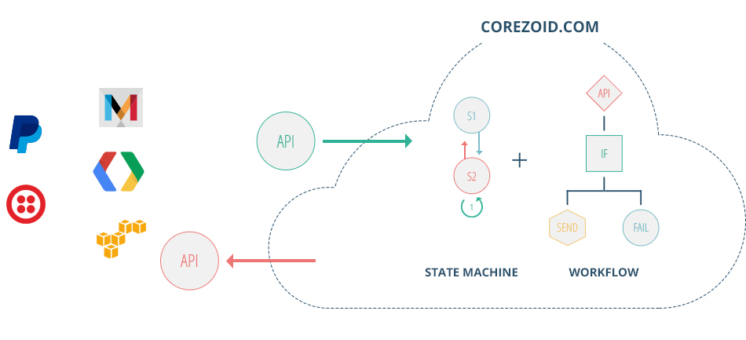

# Introduction

Corezoid is a Cloud Process Engine, that lets you build, host and run algorithms of any complexity  in the cloud: chat bots, communication scenarios, CRM functionality, client support, omni-channel marketing campaigns, hardware monitoring, anti-fraud solutions, financial management tools etc.  

As Mambu CTO Ben Goldin [said](https://www.corezoid.com/blog/mambu-corezoid-cloud-state-machine/): “Corezoid is a cloud state machine, it’s not just another BPM”.

You may think of Corezoid as a “Crazy Glue for APIs” or a metaprogramming language. It doesn’t matter which language the software you want to connect to Corezoid was created in: PHP, Perl, Python, Ruby, JavaScript, Java, Erlang, C++, C#, etc. If your system has APIs, it can push data to Corezoid, where you can describe the logic of the whole process, orchestrating data from dozens or hundreds of APIs.

Our platform dramatically increases time-to-market speed and decreases maintenance costs by shifting the paradigm from hardcoding processes by software engineers to assembling processes by any non-tech people.

Managers can set up their own real-time dashboards and escalations in just a few clicks to stay up to date with the processes, products and the whole business.

Business analysts no longer need software engineers to implement and support the processes. With Corezoid, they can easily do it themselves.

Developers can easily implement complex solutions like event processing using automata-based programming with explicit state selection.

[Let's get started](quick-start/README.md)

