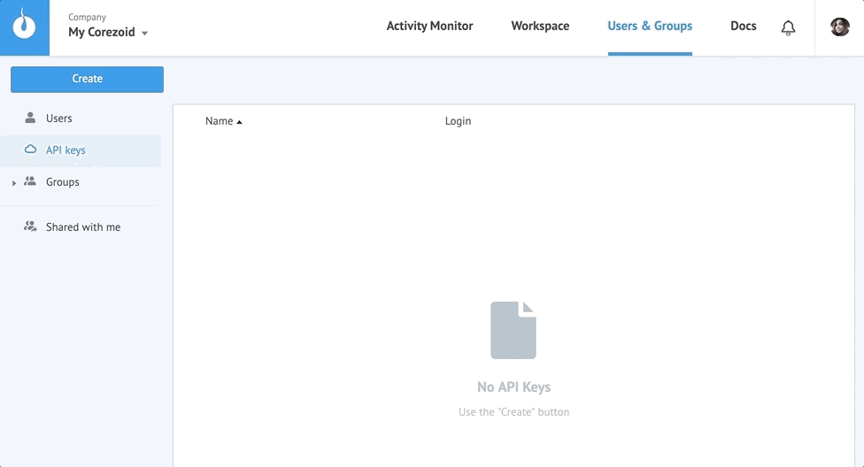

# API v2

*   [Protocol description](#protocol-description)
*   [Operations with tasks](tasks.md)
*   [Object creation](#object-creation)

## Protocol description

Before you can start using Corezoid API you need to create `API key` and get **an authorization login** and **secret key**.

`Users & Groups -> Create -> API key -> enter name -> OK`




**URL**

```
https://api.corezoid.com/api/2/json/{API_LOGIN}/{GMT_UNIXTIME}/{SIGNATURE}
```

* **{API_LOGIN}** - authorization login of your `API key`

* **{GMT_UNIXTIME}** - request time, a Unix timestamp (epoch time), by Greenwich (GMT+0), integer required parameter

* **{SIGNATURE}** - the signature

The signature is a concatenated string generated from the following parts:

`hex( sha1({GMT_UNIXTIME} + {API_SECRET} + {CONTENT} + {API_SECRET}) )`, where

* `hex()` - convert binary data to hexadecimal form
* `sha1()` - standart hash-function SHA-1, must return binary data
* `+` -  text string concatenation
* `{API_SECRET}` - a secret key of your `API key`
* `{CONTENT}` - request body

The whole request is http-body, it also described earlier in the signature formula as the `{CONTENT}`.

All text is expected to be encoded as **UTF-8**.
API request requires setting HTTP header:
`Content-type: application/json; charset=utf8`

**Request**

Request body contains a list of operations (**ops**):

```json
{
  "ops": [
    {
      "type": "create",
      "obj": "conv"
    },
    {
      "type": "modify",
      "obj": "node",
      "obj_id": "n1234"
    }
  ]
}
```

**Response**

```json
{
  "request_proc": "ok",
  "ops": [
    {
      "obj": "conv",
      "obj_id": "1234",
      "proc": "ok"
    },
    {
      "obj": "node",
      "obj_id": "n1234",
      "proc": "obj_id_not_found"
    }
  ]
}
```

| parameter | value | description |
| --- | --- | --- |
| request_proc | "ok" in the case of a successful request, otherwise - error | global status of whole package processing |
| ops | [] | list of operations |
| ops[n].proc | "ok" in the case of a successful request, otherwise - error | status for a separate operation |


## Object creation

**Request**

```json
{
  "ops": [
    {
      "id": "{{request_id}}",
      "title": "{{title}}",
      "description": "{{description}}",
      "folder_id": "{{folder_id}}",
      "company_id": "{{company_id}}",
      "obj": "{{obj}}",
      "type": "create",
      "obj_type": 0,
      "conv_type": "{{conv_type}}",
      "create_mode": "without_nodes",
      "status": "{{status}}"
    }
  ]
}
```

| parameter | accept type | description | required |
| --- | --- | --- | --- |
| request_id | string | Request id | - |
| title | string | Object title | + |
| description | string  / null | Description | + |
| folder_id | string / number | ID of the folder in which the object will be created | - |
| company_id | string  / null | Company ID (for **My Corezoid** parameter may be missing or null) | - |
| obj | string | Object type, possible values: `conv / folder / dashboard` | + |
| conv_type | string | Possible values: `process` or / `state` - state diagram | `+` only for "obj": "conv" |
| status | string | Process status. Possible values: `actived / paused / debugged` | + |

**Request**

For creating active process with title "Corezoid" in folder 11456 of company i7856235891

```json
{
  "ops": [
    {
      "id": "147",
      "title": "Corezoid",
      "description": null,
      "folder_id": 11456,
      "company_id": "i7856235891",
      "obj": "conv",
      "type": "create",
      "obj_type": 0,
      "conv_type": "process",
      "create_mode": "without_nodes",
      "status": "actived"
    }
  ]
}
```

**Response**
```json
{
  "request_proc": "ok",
  "ops": [
    {
      "id": "147",
      "proc": "ok",
      "obj": "conv",
      "obj_id": 24545,
      "folder_id": 11456,
      "hash": "ce48cf53644b20ee6ce6e936f271a4f893a29298"
    }
  ]
}
```

| parameter | description |
| --- | --- |
| id | request id |
| obj | Type of created object, possible values: `conv / folder / dashboard` |
| obj_id | ID of created object |
| folder_id | Folder ID |
| hash | Hash to make "Direct url for tasks upload" |