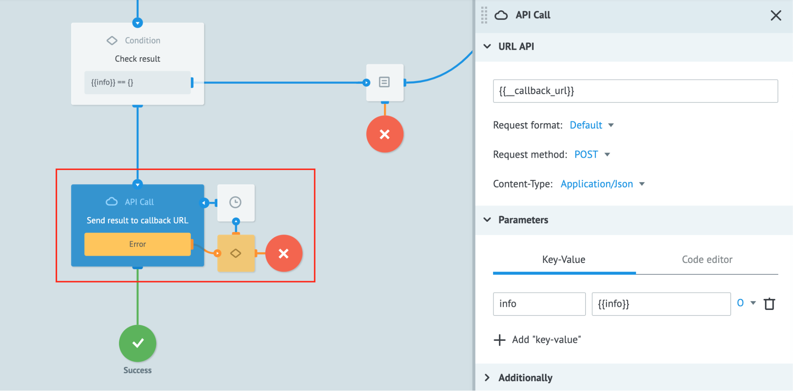

# Sync API

## Purpose

Corezoid API is _**asynchronous**_ - [when requesting to create a new Task in a Corezoid Process](https://doc.corezoid.com/en/api/v1/upload-modify.html#сreate), you receive the Task ID, not the Process output it invokes:
```
{
    "request_proc": "ok",
    "ops": [
        {
            "id": "",
            "proc": "ok",
            "obj": "task",
            "ref": "ref",
            "obj_id": "5d1b6ee5f6c37653b9904f7d"
        }
    ]
}
```

To receive the Task-invoked Process output, you need to implement _*synchronous*_ responding.

_**Example**_:

Our job is to implement the logic of P2P money transfer from client A to client B on a website that consists of:
* JS front-end without business logic.
* Corezoid back-end that manages the business logic.

Using Corezoid API for sending Tasks to a Corezoid Process, we will receive `obj_id` (Task ID) but not the requested Process output.

We cant develop the JS front-end following this approach because we receive no output from the business logic processed at the back end.
Since version 4.2, Corezoid supports the _*synchronous*_ processing of requests using the **Sync API** module. Now, you can receive requested outputs from Processes by sending requests via Corezoid **Sync API**.


## Sync API Usage Specifics

When sending a request via **Sync API**, a Task gets automatically the `__callback_url` system parameter. This parameter keeps a link to a caller service, to which Corezoid should respond:

`"__callback_url": "https://sync-api.corezoid.com/api/1/plugins/callback/{{request_id}}"`

To configure synchronous response, you need to:

1. Add the [**API Call**](https://doc.corezoid.com/ru/interface/nodes/api/) node at a Process step which should send a requested output to a caller service.
2. Provide the `{{__callback_url}}`.
3. Specify parameters which will be sent to the caller service.



## Generating Requests to Sync API from External Services

### URL

`https://sync-api.corezoid.com/api/1/json/{{API_LOGIN}}/{{GMT_UNIXTIME}}/{{SIGNATURE}}`

* {{API_LOGIN}} - [authorization login](https://doc.corezoid.com/en/interface/users_groups.html#api-keys)
* {{GMT_UNIXTIME}} - request time
* {{SIGNATURE}} - request signature

Request time should be Unix time: number of seconds elapsed from the Unix epoch at the GMT+0 Time Zone.

Request signature is created according to the [standard Corezoid API protocol](https://doc.corezoid.com/en/api/v1/spec.html).

You need [grant access](https://doc.corezoid.com/en/interface/users_groups.html#providing-access-to-the-object) to **Task management** to an **API key** which login and password are used in a request.


### Request Body

```
{
    "timeout": 30,
    "ops": [{
        "conv_id": {{CONV_ID}},
        "type": "create",
        "obj": "task",
        "data": {
            "param": 1
        }
    }]
}
```

| parameter | accept type | description | required | possible value |
| --- | --- | --- | --- | --- |
| ops| JSON Object | The list of operations to proceed via Corezoid API. A parameter keeping JSON objects with operations | + | * The number is user-limited by RPS limit. |
| type | string | A type for creating a Task | + | create |
| conv_id | number / number as string | An ID of a Process for which the Task is created | + | An ID of an existing Process |
| obj | string | An object type | + | task |
| data | JSON Object | An object with key-value pairs describing necessary parameters | + | ** The quantity of parameters is not limited |
| timeout | number | The maximum time to wait for a response | - | The number of seconds, it is 60 seconds by default |

*See the license agreement

**A Task is limited to a size specified in a configuration file.

### Response

```
{
    "ops": [
        {
            "proc": "ok",
            "data": {
                "info": {
                    "param_1": "value_1",
                    "param_2": "value_2",
                    "param_3": "value_3"
                }
            }
        }
    ],
    "request_proc": "ok"
}
```

| parameter | value | description |
| --- | --- | --- |
| request_proc | It is ok for the successful accomplishment or error otherwise | The global processing status of the whole package |
| ops | [] |A list of operations as requested |
| ops\[n\].proc | It is ok for the successful accomplishment or error otherwise | Processing status of a given operation |
| data | An object with key-value pairs describing necessary parameters | Data specified for response in the API Call node |


## Error Types

### Did not wait for/receive a response
If a request did not use the `timeout` parameter, and there was no response within 60 seconds.

`504 Gateway Time-out`

### Did not receive a response within the specified time limit
The `timeout` parameter is used to specify the waiting time in seconds. If there was no response within the specified time limit, an error is raised:

```
{
    "request_proc": "ok",
    "ops": [
        {
            "proc": "error",
            "description": "Timeout for create task"
        }
    ]
}
```