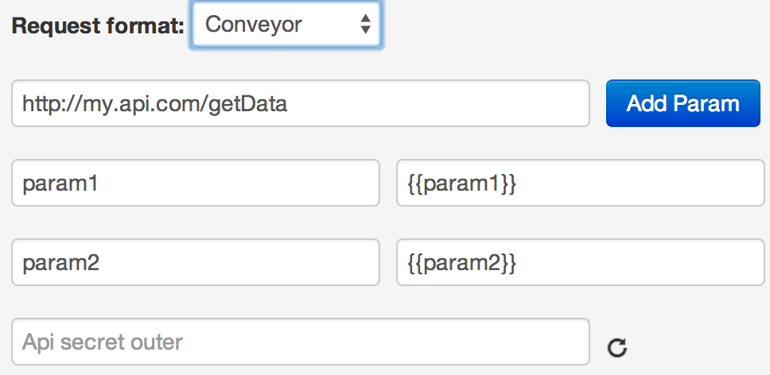

# Process format

Example of calling URL: http://my.api.com/getData via API logic on the task with ref="130605":



**POST request from process to API**
*   http://my.api.com/getData?conv_signature={SIGNATURE}&conv_time={GMT_UNIXTIME}

Parameters `conv_signature` and `conv_time` are automatically added to URL by process and can be used for checking access to called API.

`conv_signature` is formed according to  [formula](../), where `API_SECRET` is a key, generated in node by API logic.

**Request body**
```json
{
    "ops":[
        {
        "ref":"130605",
        "type":"data",
        "obj":"task",
        "obj_id":"t71001",
        "conv_id":"1234",
        "node_id":"n10221",
        "data":{
            "phone":"380501234561",
            "card":"4134000011112221"
        },
        "extra":{
                "param1":"Value",
                "param2":"Value"
            }
        }
    ]
}
```

API called from a process gets parameters from `extra` block, variables in `data` may be absent.

**Response to process in case of successful operation execution (HTTP status code = 200):**
```json
{
    "request_proc":"ok",
    "ops":[
        {
            "ref":"130605",
            "obj_id":"t71001",
            "proc":"ok",
            "res_data":{
                "res":"0"
                }
        }
    ]
}
```

**Response to process in case of failure of operation execution (HTTP status code = 500):**
```json
{
    "request_proc":"ok",
    "ops":[
        {
            "ref":"130605",
            "obj_id":"t71001",
            "proc":"fail",
            "res_data":{
                "error":"Text error"
                }
        }
    ]
}
```

Content of `res_data` is automatically added to request to process (to 'data' object), thus request will contain a new parameter - `result="0"`


> **[List of process responses](../../interface/create/api.md#create_task_error) on API logic calling.**

