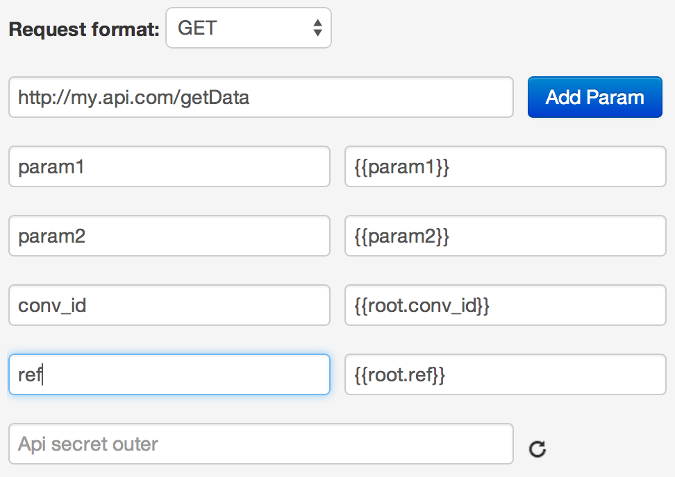

# GET format

Example of calling URL: http://my.api.com/getData via API logic on the task with ref="130605":



**GET request from process to API**
*   http://my.api.com/getData?conv_signature={SIGNATURE}&conv_time={GMT_UNIXTIME}&param1=Value1&param2=Value2&conv_id=1234&ref=1234

Parameters `conv_signature` and `conv_time` are automatically added to URL by process and can be used for checking access to called API.

`conv_signature` is formed according to  [formula](../), where `API_SECRET` is a key, generated in node by API logic.

**Response to process in case of successful operation execution (HTTP status code = 200):**
```json
{
    "answerParam":"ok"
}
```

**Response to process in case of server error (HTTP status code = 500):**
```json
{
    "textError":"Text error",
    "codeError":"Code Error"
}
```

Content of `json` is automatically added to request to process (to 'data' object).


> **[List of process responses](../../interface/create/api.md#create_task_error) on API logic calling.**

