# Creating a New Bot via Bot Platform 2.0

A bot in Corezoid is a separate project, which is created from scratch following a simple procedure:

- [Step 1. Creating bots in messengers](#step-1-creating-bots-in-messengers)

  - [Telegram](#telegram)

  - [Viber](#viber)

  - [Facebook Messenger](#facebook-messenger)
  
  - Apple Business Chat (iMessage) - coming soon
  
- [Step 2. Creating a Company in Sender](#step-2-creating-a-new-company-in-sender)

- [Step 3. Connnecting bots to Bot Platform](#step-3-connecting-bot-to-bot-platform-at-corezoid)

You can connect Bot Platform with new or earlier created messenger bots.

---

## Step 1. Creating bots in messengers

Bot Platform accesses bots in the messengers using HTTP API with token identification. This section discusses the procedures of obtaining access tokens for each supported messenger. If you want to connect an existing bot to Bot Platform, you can go to the next phase.

A token is a key for accessing your bot. Anyone who possesses this key can control your bot. 

>The token storage and access to it must comply with security requirements for sensitive data.

### Telegram

1. Begin a chat with [BotFather](http://telegram.me/BotFather) and click the **Start** button.
2. Send the `/newbot` command to BotFather to create a new bot. 
3. Follow the BotFather’s instructions:
    - Give your bot name.
    - Give your bot username to be displayed in contacts, chats, and address. A username must have the **bot** ending, for example, **TetrisBot** or **tetris_bot**. _A name and username of a bot must be unique in Telegram_. 
4. Save the access token to your bot.  
    

### Viber

1. Log in to [partners.viber.com](https://partners.viber.com/) with your Viber account.
2. Click **Create Bot Account**.
3. Fill in the bot creation form.
4. Save the access token to your bot.
    

### Facebook Messenger

1. Log in to your [Facebook accont](https://www.facebook.com/).

2. As each Facebook bot must be connected to a Facebook page, create a new page your bot will be connected [following these instructions](https://www.facebook.com/help/104002523024878?helpref=about_content).

3. Go to [Facebook for Developers](http://developers.facebook.com/apps).  If you are new here, you need to register as a developer.

4. Point to **My Apps** and then click **Create New App**.

5. In the **Create a New App ID** dialog box appeared, fill in all the fields and then click **Create App ID**. Your new application is created.

    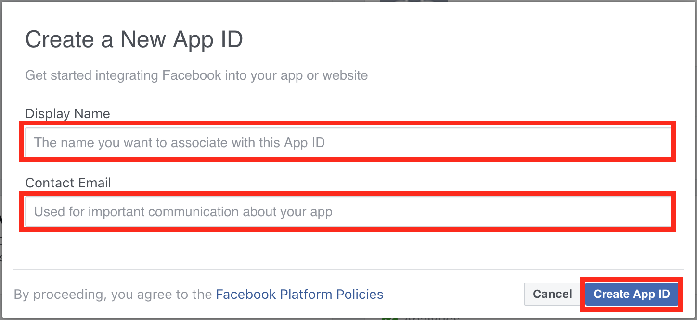

6. Click the **icon** of the creating app. You should land on the app’s setup page.
    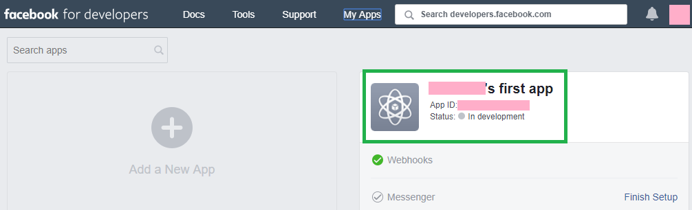

7. Go to the **Dashboard** category on the left side menu of the setup page.

8. In the **Add a Product** pane, find **Messenger** and click the **Set Up** button below it. The **Messenger** entry appears under **Products** on the left side menu, and you will be at the **Messenger Platform** settings page.

    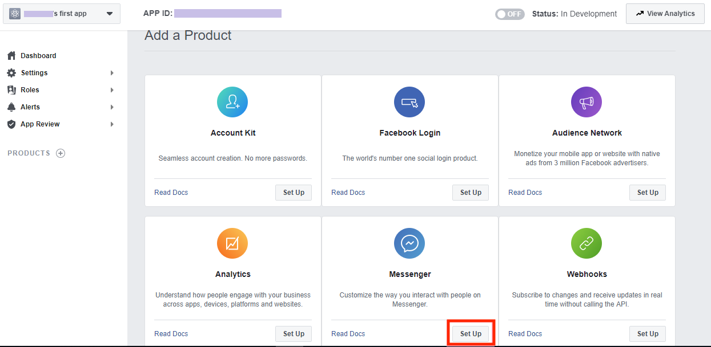

9. Go to the **Access Tokens** section, where select the necessary page in the **Page** drop-down list, and then click **Edit Permissions**. This should be the page you created at step two.

    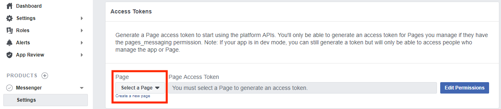

10. In the new browser dialog box appeared, click **Continue as _Your Profile_ Name** to confirm assigning your bot to your Facebook account.

    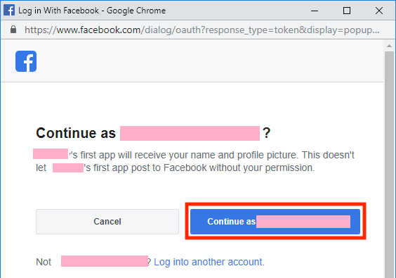

11. Then, set the check box for the **page** your bot will be attached and click **Next**. This should be the page you created at step two.

    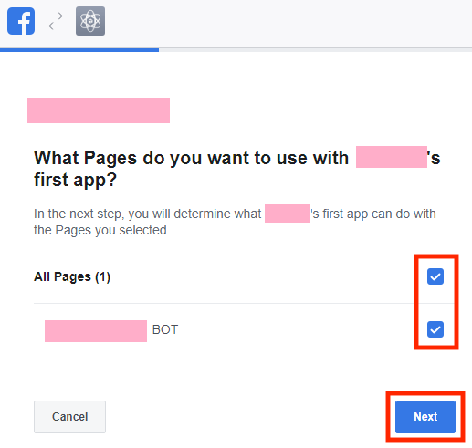

12. Set the toggle for **_your page_** to **YES** to allow your bot to participate in the P2P chats in the messenger at this page and then click **Done**.

    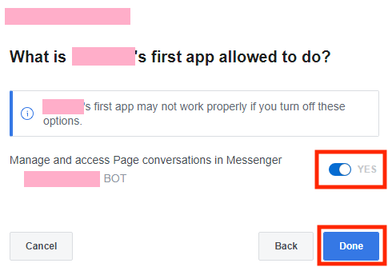

13. Click **Ok**.

    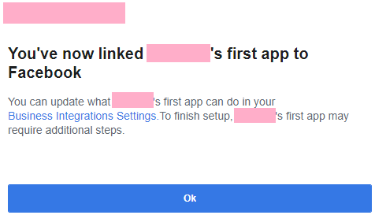

14. In **Page Access Token** field, the access token appears.

    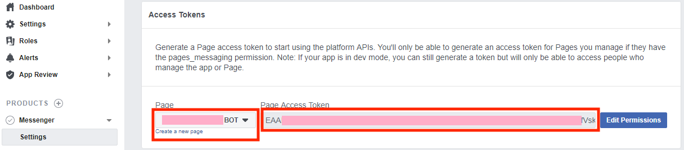
    
15. Save this token.

---

## Step 2. Creating a New Company in Sender

Along with communication automation, Bot Platform features an ability to involve an operator in a conversation for providing client support if it is necessary. The operator’s workplace is organized using the [Sender](https://sender.mobi/) messenger. 

When creating a new bot project, you need to select an existing Sender Company or create a new one. 

This section discusses how to sign up for Sender and to create the new Company there. If you want to connect the existing company you can go to the
[next section](#step-3.-connecting-bot-to-bot-platform-at-corezoid).

There are mobile (Android, iOS) and web Sender client applications. You can sign up and work as an operator with any app kind. This section covers the web one.

For signing up, you need to provide a cell phone number, at which your Sender account and the first company will be registered. 

**To sign up with a mobile app, use this procedure:**

1. Install the app at your device:
    - [Sender at Google Play for Android](https://play.google.com/store/apps/details?id=mobi.sender).
    - [Sender at App Store for iOS](https://itunes.apple.com/us/app/sender-c/id980844011).
2. Allow the access rights the app asks for.
3. Provide the phone number for registration.

**To sign up with a web app, use this procedure:**

1. Go to the [Sender web app apge](https://chat.sender.mobi/auth).

    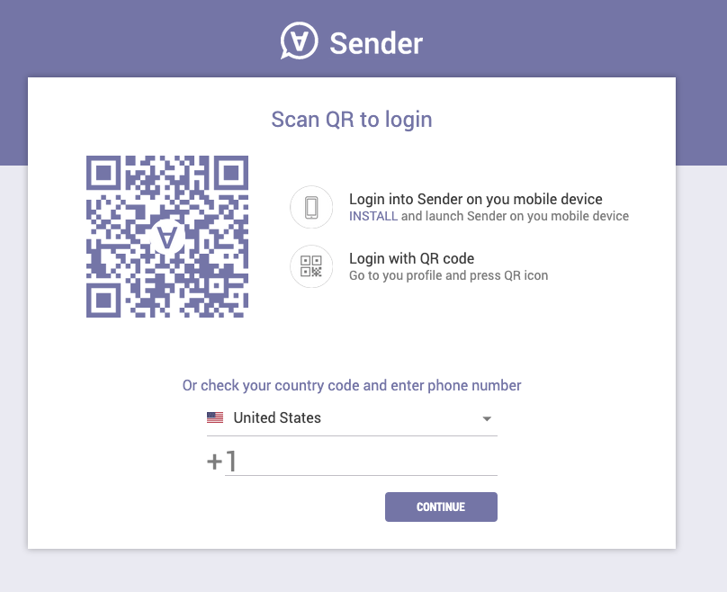
    
2. Type the phone number for registration and click **CONTINUE**.

    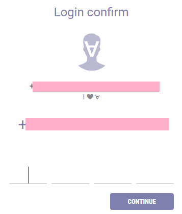

3. Type the activation code received by SMS and click **CONTINUE**.

When signed up successfully, you are at the web app main page.

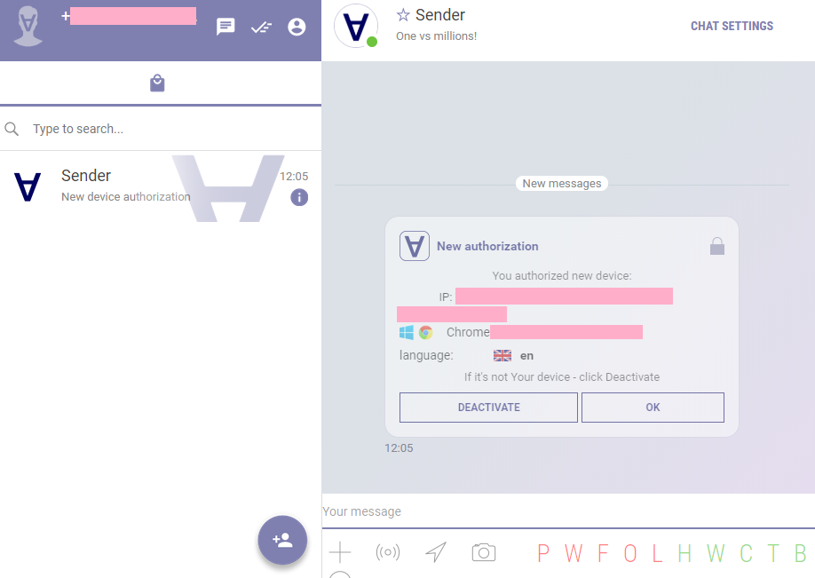

At signing up for Sender, a new Company is created and registered at the phone number given for registration. For working with a bot project, you need to create another new Company. 

**All further procedures in this section assume that you:**

1. Created your Sender account.
2. Went to the [administrator page](https://admin.sender.mobi/).

    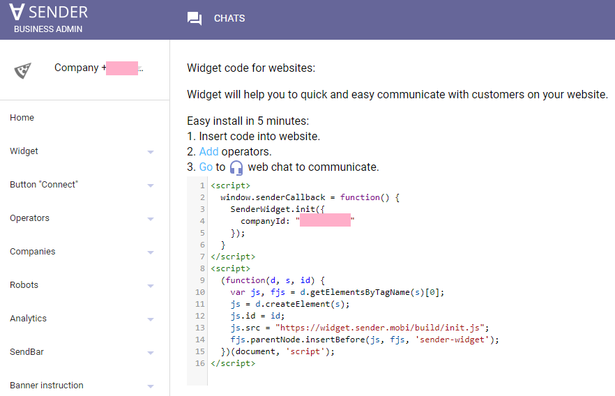

Your Sender Company is attached to your Corezoid account automatically during its creation if you registered it at the same email address as provided at your Corezoid account. The default Company created during signing up for Sender is not automatically attached to Corezoid because it is registered at a phone number. 

**To create a new Sender Company with automatic attaching it to Corezoid, use this procedure:**

1. In the left side menu, go to the **Companies > Create** section.

    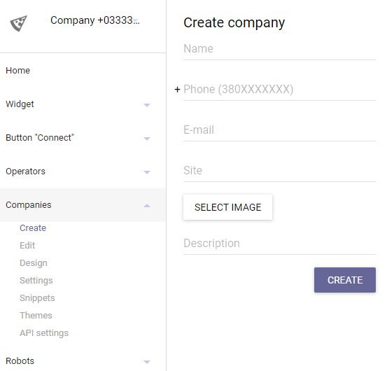

2. Fill in the required fields **Name** and **Phone**.

3. In the **E-mail** field, enter the email address your Corezoid account is registered at.

4. If it is necessary, fill in other fields.

5. Click **Create**. A new Company is created, which is also synchronized with Corezoid.

    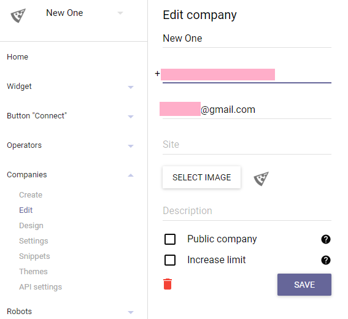

> If of any reason you cannot provide for a Sender Company the email address used at your Corezoid account, you can try to attach such a Company to Corezoid using robots:

1. In the left side menu, go to the **Robots > Robots** section.

    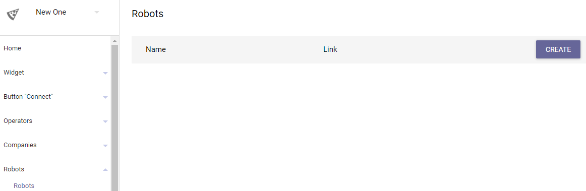
    
2. Click **Create**. The **New robot** pane appears.

    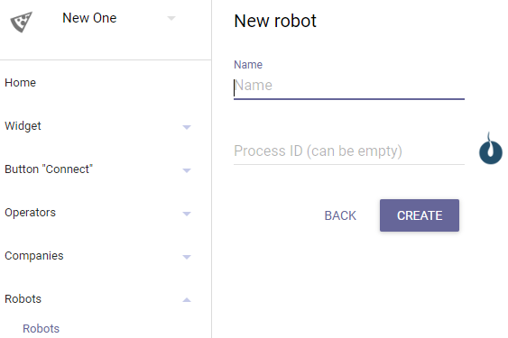

3. Fill in the required **Name** field.
4. Click **Create**. The new robot is created in the Sender company, and this Company is also synchronized with Corezoid.

    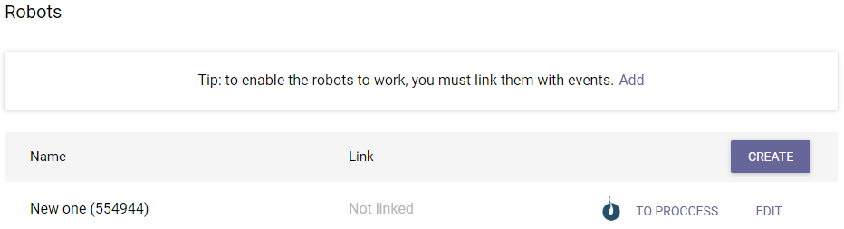

Sender is the workspace of operators. The user created a new Sender Company is the only Operator there having the **Owner Role**. For adding new Operators, go to **Operators > Manage**.

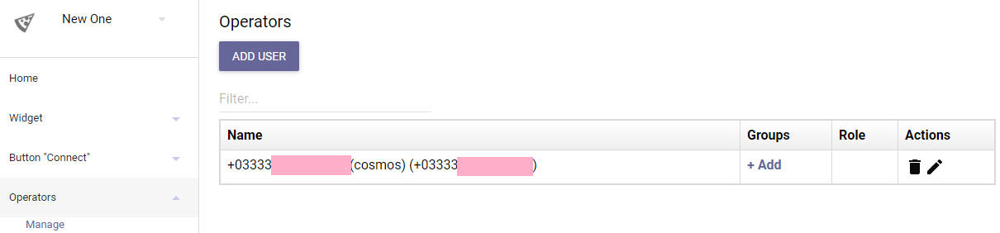

You can use Roles to delimitate access within your colleagues in the scope of one Sender Company. 

**To do so, you need to add a colleague as an Operator and to set the necessary Role for this person:**

1. Ensure the colleague is signed up for Sender; otherwise, you will not be able to add this person.

2. Click **ADD USER**. The **Invite user** pane appears.

    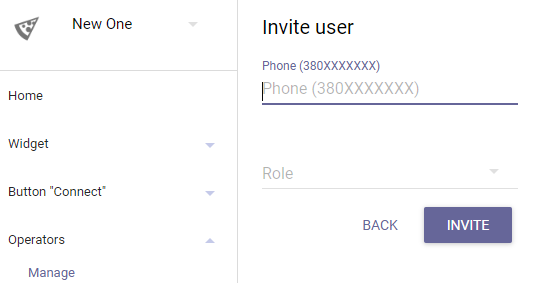

3. Enter your teammate’s phone number in the **Phone** field.

4. Specify your teammate’s role at the Company in the **Role** field.

5. Click **INVITE**. The teammate will receive invitation message in Sender.

6. The teammate must confirm your invitation. After confirmation, this person appears in the **Operators** grid in the **Operators > Manage** section.

You can find more information about Sender in its [documentation](https://doc.sender.mobi/index.html).

---

## Step 3. Connecting Bot to Bot Platform at Corezoid

**Use the following procedure to create Bot Platform:**

1. Go to [Corezoid admin panel](https://admin.corezoid.com/).

2. At the left top corner, click the **Company** drop-down list and select the **_created earlier Sender Company_** in it. 

    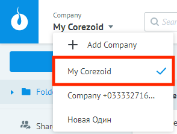

3. Click **Create** and then click **Bot Platform** in the drop-down list.

    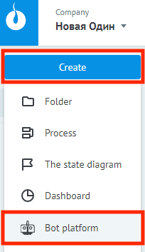

4. In the **Bot Platform** dialog box, select check boxes for the messengers to be connected and enter a token for each selected.

    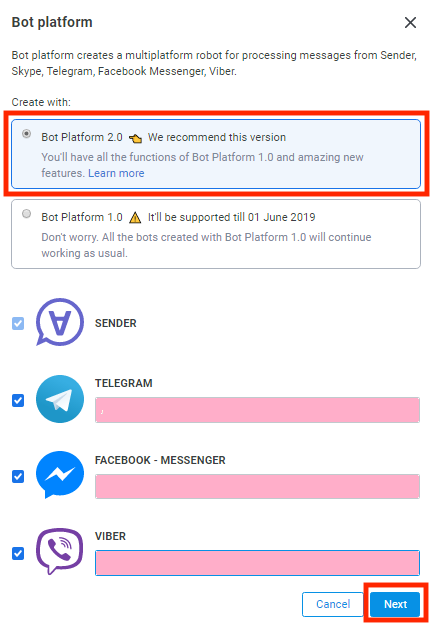

5. Ensure the **Bot Platform 2.0** version is selected.

6. Click **Next**. The process of connecting messengers started - please, wait for notification about the successful completion of this process.

    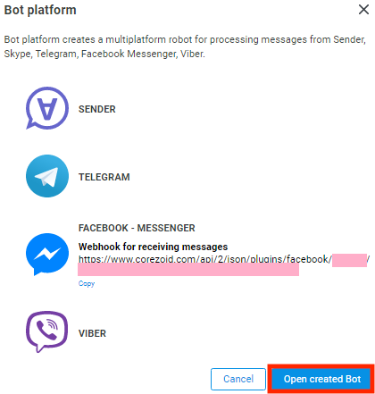

7. If the connecting process didn’t succeed, check each token to be valid.

8. If you connect Facebook Messenger, you also need to subscribe to Facebook Messenger Webhooks at the Facebook admin panel. The procedure of subscribing to Facebook Messenger Webhook is discussed below in this section.

9. Click **Open created Bot**. You are in the **Bot Platform** folder. This folder is discussed in details in section [Bot Platform 2.0 Components Overview](components.md).

    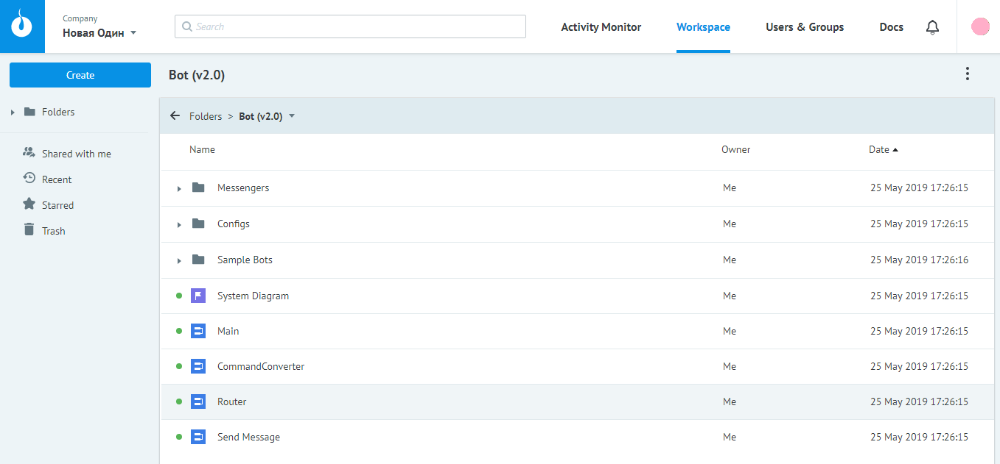

**To subscribe to Facebook Webhook manually (for other messengers it’s done automatically), use the following procedure:**

1. Go to your Facebook app’s page at [Facebook for Developers](http://developers.facebook.com/apps). 
2. Copy the access token, which is discussed at steps 12-13 of the [creating a new Facebook Messenger bot](#facebook-messenger) procedure.
3. In the left side menu, go to the **Messenger > Settings** section and click **Subscribe** to **Events**. 

    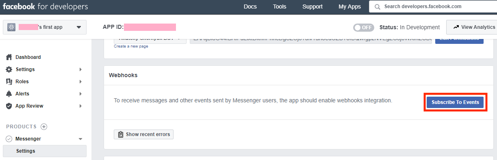
    
4. Paste the copied token in the **Verify Token** field of the **New Page Subscription** dialog box appeared.

    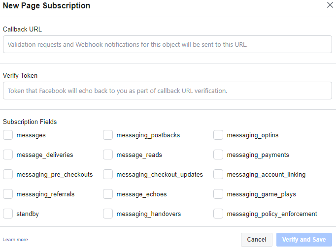

5. Go to the **Bot Platform** dialog box of Corezoid and click **Copy** under Webhook URL for Facebook Messenger.

    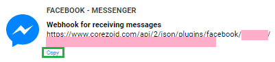

6. Go to the **New Page Subscription** dialog box of Facebook, and past the copied Webhook URL in the **Callback URL** field.

7. Select the check boxes of [events](https://developers.facebook.com/docs/messenger-platform/webhook), the Corezoid process should receive. It is recommended to select:  `messages, messaging_postbacks` and `messaging_optins`.

    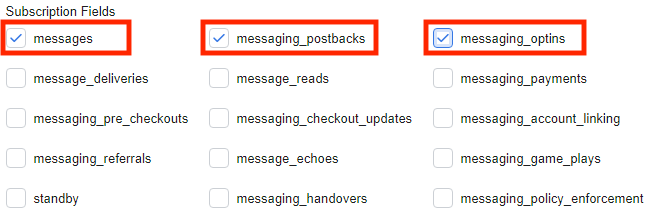

8. Click **Verify and Save**. The dialog box should disappear. Also, the selected events and the **Select a Page** drop-down list should appear in the **Webhooks** pane.

    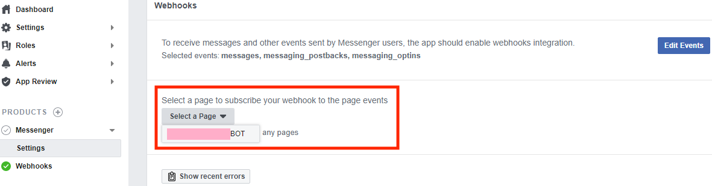

9. In this drop-down list, select the **_page_**, at the events of which your page will be subscribed. There should appear the **Subscribe** button.

     

10. Click **Subscribe**. 

    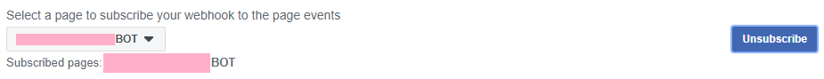

🎊 **Congratulations! You’ve created your first Bot Platform.** 

---

Open the created bot at the messenger and follow to the next section: [Built-in features of Bot Platform 2.0](basic-functionality.md)
