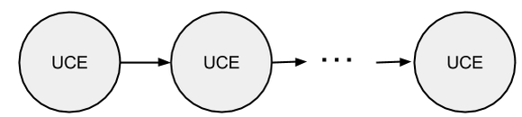

#Glossary

**Process** - algorithm, process or program, realized with sequence, set or many of nodes.

**Node** - universal computational element (UCE), that describes object state.

Node has such characteristics as queue, functions, logic, counters.

`f` - request of appropriate function node(i)

`F `- every node get an appropriate function, that can be realized through human, API, code or other node

`Cт` - counter, T-time of the oldest object in queue

`Cn` - amount of objects in queue

`{Ci}` - custom counters

**Queue** - queue of objects in node.

**Object** - set of parameters, characterizing the object.
According to certain rules, there's an object's information processed in node - applying to object.

**Functions** - actions that must be to done on the object from queue in node. Functions can be in a form of API, program code,other process etc. 

**Logic** - tools of logic's management in the node. May be systemic and user.
System logic T - specified time of how long object can stay in the node.
System logic N - specified amount of objects that can be in queue in node.

**Counters** - shows only value without any actions (unlike logic). Also could be systemic and user.
