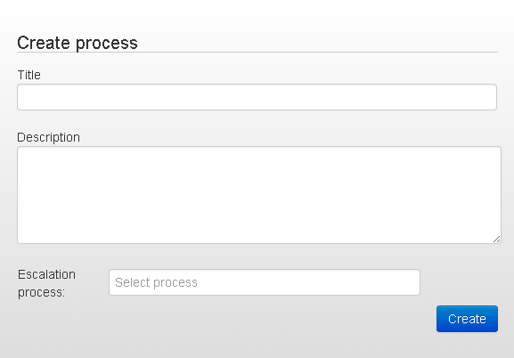

##Process creation

For creation of new process go to **Processes** section and click **Create process**.

after that a process description panel will be displayed.

> **Tip:** create a draft block scheme beforehand, on paper or in electronic form - it will allow to realize it on process more quickly.

**Title** - name of a process

**Description** - descrtiption of a process

If possible specify list of parameters of request that is processed in process.

> **Example:**
>- phone - phone number
>- textSms - SMS text
>
> Description of incoming parameters will simplify testing and process support.

###Types of nodes:
- **start** - start node. Recommended name - “Entry” and presence of one Go logic - switch to the next node.
- **normal** - standard node for describing the business logic
- **escalation** - differs from normal only by type and colour in order to simplify grouping information in a dashboard. Recommended to use in case of switching from “Escalation node” logic.
- **final** - final node, in which nothing can be added.

####Start node

Process can have only one start node. If you removed this node, exit process and open it again - then you will be able to create a new start node.

####Normal and Escalation nodes

may contain the following logics:
- **[counter](counter.md)** - counter of number of requests in a node. Upon reaching set value signal is passed to escalation node.
- **[timer](timer.md)** - timer of placing the request in a node. Upon reaching set value, the request are transfered in the node specified in “Select to go node”
- **[Go](go.md)** - unconditional switch to the next node in case neither of Go If, Timer, Counter conditions are met. Can be added to a node 1 time.
- **[Go If](go_if.md)** - conditional branch. Variants of conditions =, !=, <, >, regex
- **[API](api.md)** - external API call with parameters.
- **[API callback](api_callback.md)** - waiting for response from external system request.
- **[API code](api_code.md)** - possibility to realize an additional logic of request processing in one of the languages (javaScript, Erlang, Lua)
- **[API copy](api_copy.md)** - copying request to another process
- **[API RPC](rpc/README.md)** - interaction with general process
- **[API sum](sum.md)** - summing up values by the certain field or request.
