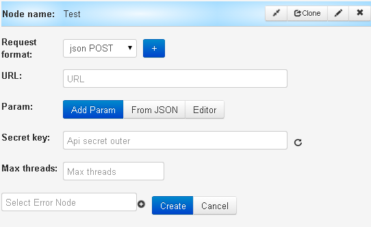
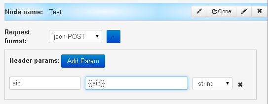
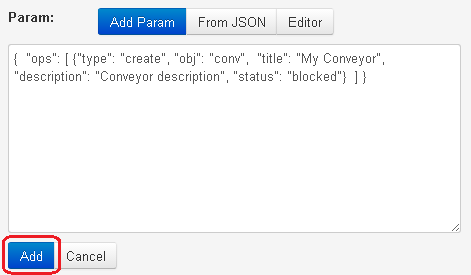
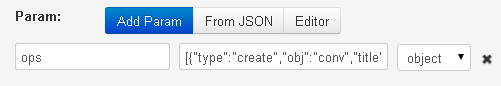
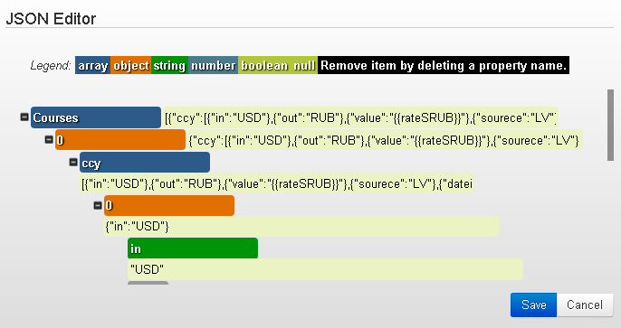

## API logic

- **Request format** - choose of request format:  json POST, GET, Conveyor, NVP

>Clicking the button **"+"** near the field of selecting format gives possibility to add parameters in header of request - **Header params**.

-   **URL** - link to API
-   **Param** adds incoming parameter that will be sent to API mentioned above. All incoming parameters are sent in extra array

**`Add Param`** - Key (parameter name) = value (parameter value)

Value may contain:
-   constant
-   `{{parameter name}}` from request, its value will be pastedfrom request, its value will be inserted. If parameter contains an array or its name is incorrect - an empty line will be inserted in this place
-   `{{root.task_id}}` - request id, generated by the process
-   `{{root.ref}}` - request reference
-   `{{root.conv_id}}` - process id
-   `{{root.node_id}}` - node id
-   `{{root.prev_node_id}}` - previous node id
-   `{{root.status}}` - request status (1 - in stack, 2 - processed by operator, 4 closed)
-   `{{root.create_time}}` - time of request creation in unixtime format
root.change_time}}` - time of request change in unixtime format
-   `{{root.end_time}}` - dynamic time of launching timer (e.g. if you need timer to wake you up at 8 a.m.)
-   `{{root.user_id}}` - user id, the last one who changed the request

**`From JSON`** - a ready request can be inserted in the format JSON and clcik on “Add”, then parameters and their format will be placed automatically

**`Editor`**- JSON editor

- **Secret key** - turnround arrow neat the field generate a secret key for API
- **Max threads** - number of threads. The field is not compulory for filling. 1 is set by default
-   **Select Error Node** - node of escalation is added automatically after clicking on “Create”

###Response API

Response from API will be processed if its format is:
- `json`. All parameters from response will be added to the request
- `json array`. Content of massif will be added to the variable `__conveyor_api_array__`
- `image`. Content will be modified to base64 and added to variable `__conveyor_api_image__`

<section id="create_task_error" />
### Errors processing

If the error occurs, process sends request to the node **Escalation** (if it is chosen) and adds to the request following parameters:

| Parameter name| Parameter description |
| -- | -- |
| `__conveyor_api_return_type_error__` | error type (hardware/software)|
| `__conveyor_api_return_type_tag__` | error code |
| `__conveyor_api_return_type_description__` | error description |

<bookmark id="error">
### Error types

#### Request to API hangs for a long time. Used all connects to API (max_threads) or  API does not answer for a long time.

| Parameter name | Value |
| -- | -- |
| `__conveyor_api_return_type_error__` | hardware |
| `__conveyor_api_return_type_tag__` | api_expire_query |
| `__conveyor_api_return_description__` | Expire task to API, please check your api for correct answer, or increase max_threads for connections` |

#### Error of adding parameters to the request

| Parameter name | Value |
| -- | -- |
| `__conveyor_api_return_type_error__` | hardware |
| `__conveyor_api_return_type_tag__` | api_bind_error |
| `__conveyor_api_return_description__` | Error bind params to http query |

#### Inner error of conveyor

| Parameter name | Value |
| -- | -- |
| `__conveyor_api_return_type_error__` | hardware |
| `__conveyor_api_return_type_tag__` | api_fatal_error |
| `__conveyor_api_return_description__` | Error running api |

#### Did not wait /receive response from API

Maximum processing time of one request to the API= 60 sec. Upon the expiry of this time, the request is passed into the node **Escalation** with following parameters:

| Parameter name | Value |
| -- | -- |
| `__conveyor_code_return_type_error__` | software|
| `__conveyor_api_return_type_tag__` | api_bad_answer|
| `__conveyor_api_return_description__` | timeout или failed_connect ...|

#### Not valid JSON

| Parameter name | Value |
| -- | -- |
| `__conveyor_api_return_type_error__` | software |
| `__conveyor_api_return_type_tag__` | api_no_valid_json |
| `__conveyor_api_return_description__` | Please check |

#### Wrong `request_proc` in the response

| Parameter name | Value |
| -- | -- |
| `__conveyor_api_return_type_error__` | software |
| `__conveyor_api_return_type_tag__` | api_no_request_proc |
| `__conveyor_api_return_description__` | Bad request_proc tag. Please fill request_proc=ok for your answer. If you want to put error use proc!=ok |

#### No block `ops` in the response

| Parameter name | Value |
| -- | -- |
| `__conveyor_api_return_type_error__` | software |
| `__conveyor_api_return_type_tag__` | api_no_ops |
| `__conveyor_api_return_description__` | No ops. Please check documentation |

#### Error in converting of parameters

| Parameter name | Value |
| -- | -- |
| `__conveyor_api_return_type_error__` | software |
| `__conveyor_api_return_type_tag__` | api_wrong_convert_param |
| `__conveyor_api_return_description__` | Param: ___, Value: ____, Try convert to: |

#### Wrong res_data in API response

| Parameter name | Value |
| -- | -- |
| `__conveyor_api_return_type_error__` | software |
| `__conveyor_api_return_type_tag__` | api_bad_res_data |
| `__conveyor_api_return_description__` | Bad res_data: ", Data/binary, ". Please check documentation |

#### Size of the response from API more 128Kb

| Parameter name | Value |
| -- | -- |
| `__conveyor_api_return_type_error__` | software |
| `__conveyor_api_return_type_tag__` | api_task_size_overflow_limit |
| `__conveyor_api_return_description__` | Your task size: {{size_data}} bytes, Max available task size: 128000 bytes, Try to change your data or try to split your task ... |
