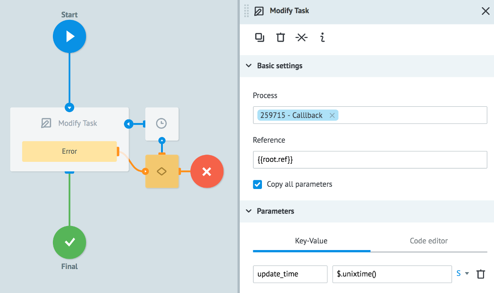

## API callback logic

Logic is used for asynchronous interaction with external API and other processes.

When request gets into a node with `API callback` , it 'hangs up' and waits for the external system response.

There are two options of updating data in request:
* General method ["Modify - change of request in process through “callback”](../../api/upload_data/Modify.md) or logic [API copy](api_copy.md)
* Personal URL for every process. through which requests on changing the data are taken.

|  | General Method Modify | Customized Modify |
| -- | -- | -- |
| Format of received  data | JSON in the format Corezoid  | JSON of any structure |
| Authorization of requests  | By pattern that  is formed for each request | No |
| Is it necessary to indicate in which field of request  is task_id? | No | Yes |

###Compulsory condition using callback

In order the requests would not be stucked all the time in a node, it is nececessary to use the logic `timer` and exctract expired requests out of node.

Example:

`How does it work as an example`:

If the request, that is stucked in a node “Waiting answer”, will be updated during 600 seconds (i.e. callback is received), then it will be switch to the node “final”.
If the callback is not received during 600 seconds, then the request  goes to the node “No answer”.

###Data change on request in one process from another one

###Data change on request in one process from external API through standard method Modify

If the external API knows the value “task_id”, then parameter “ref”  can be changed to it.

###Change of data on request in one process from external API through personal URL of process

