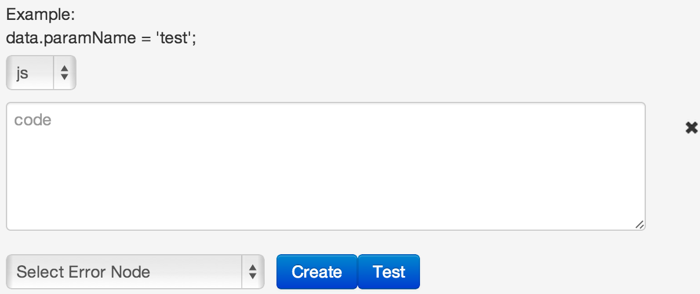
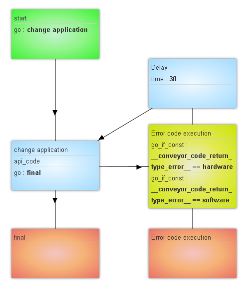

## API code logic

Availabe languages using which it is possible to change a request:
- JavaScript (js)
- Erlang (erl)

Available parameters in code
-   **data.variable name** from request
-   request system parameters
    -   root.task_id - request id, generated by process
    -   root.ref - request reference
    -   root.conv_id - process id
    -   root.node_id - node id
    -   root.prev_node_id - previous node id
    -   root.status - request status (1 - in stack, 2 - processed by operator, 4 closed)
    -   root.create_time - request creation time in unixtime format
    -   root.change_time - request change time in unixtime format
    -   root.end_time - dynamic time of launching timer (for e.g. if you need timer to wake you up at 8 a.m.)
    -   root.user_id - user id, the last one who changed the request

### Errors processing

Errors processing If error occurs when executing code, process conveys a request to:
- `Error node` node if it is selected in `Select Error node` block.
- If `Select Error node` is not empty, logic  `go_if`, `go` added to the current node.

When errors occur, process sends request to **Escalation** node (if it is selected) and adds the following parameters to the request:
  1.  `__conveyor_code_return_type_error__` - error type
    -  **hardware** - execution error inside process
    -  **software** - error occured on calling API
  2.  `__conveyor_code_return_type_tag__` - error code
  3.  `__conveyor_code_return_type_description__` - error description

Maximum time of one code example execution is not more than 5 sec., upon expiration of this time user will receive an error in the format described in p.1 with **hardware** value.

### Types of errors

####Timeout of user code execution

| Parameter name | Value |
| -- | -- |
| `__conveyor_code_return_type_error` | hardware |
| `__conveyor_code_return_type_tag__` | code_timeout |
| `__conveyor_code_return_description__` | timeout for executing code |

####User code execution error
| Parameter name | Value |
| -- | -- |
| `__conveyor_code_return_type_error` | software |
| `__conveyor_code_return_type_tag__` | code_executing_error |
| `__conveyor_code_return_description__` | error text |

####Invalid response format of user code
| Parameter name | Value |
| -- | -- |
| `__conveyor_code_return_type_error` | software |
| `__conveyor_code_return_type_tag__` | code_return_format_error |
| `__conveyor_code_return_description__` | error text |

### Use example

