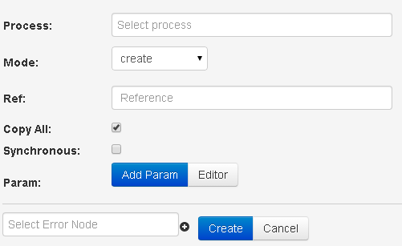

## API copy logic

Allows to copy full/part of request to another available process.

-   **Select process**, choose a process from a drop-down list or by name. Only available processes for user are displayed.
-   **Mode** request will be created (create) or modified (modify) in chosen process
-   **Ref** request identifier. The following options are possible:
    -   `{{root.ref}}` - copying identifier of current request
    -   {{parameter name}}...{{parameter name}}
-   **Copy all** [v] - sending all parameters from  request to chosen process
-   **Copy all** [ ] - sending only specified parameters to chosen process. Possible options of **value** content:
    -   constant
    -   `{{parameter name}}` from a request, which value will be pasted. If parameter contains array or parameter name is incorrect, an emply line will be pasted
    -   `{{root.task_id}}` - request id, generated by process
    -   `{{root.ref}}` - request reference
    -   `{{root.conv_id}}` - process id
    -   `{{root.node_id}}` - node id
    -   `{{root.prev_node_id}}` - previous node id
    -   `{{root.status}}` - request status (1 - in stack, 2 - processed by operator, 4 closed)
    -   `{{root.create_time}}` - request creation time in unixtime format
    -   `{{root.change_time}}` - request change time in unixtime format
    -   `{{root.end_time}}` - dynamic time of launching timer (for e.g. if you need timer to wake you up at 8 a.m.)
    -   `{{root.user_id}}` - user id, the last one who changed the request
- **Select Escalation Node** choosing or adding with the use of (+) a new node for errors processing

### Types of errors

| Parameter name | Value | Description |
| -- | -- | -- |
| `__conveyor_copy_task_result__` | crash_api | Error of the sending the request in RPC process |
| `__conveyor_copy_task_result__` | not_unical_ref | Request with such reference in process  |
| `__conveyor_copy_task_result__` | access_denied | No access to selected process |
| `__conveyor_copy_task_return_type_tag__` | copy_task_fatal_error | Error of request sending in process  |
| `__conveyor_copy_task_return_type_tag__` | copy_task_size_overflow_limit | Size of return data exceeds 128 Kb |
| `__conveyor_copy_task_return_type_tag__` | copy_task_wrong_convert_param | Impossible to convert variables into required types |
