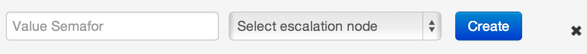
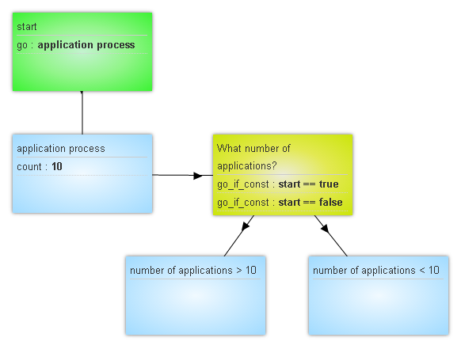

## Counter logic

Work logic:

 - Upon reaching or exceeding “Critical number of requests in the node” specified in `Value Semafor` field, escalation node is sent as `start=true` signal indicating escalation start
 -   when the number of requests in the node is reduced to a level below the critical value, escalation node automatically receives `start=false` a signal for closing of escalation

