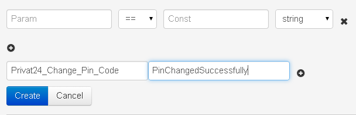
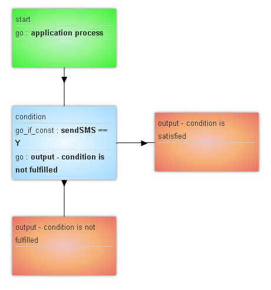

##Go If logic

Conditional branch




`Param` must include the name of variable. Possible format:
* name_parameter
* {{obj.name_parameter}} if it needed to compare with the enclosed parameter.

`Const` can include:
*   value with which the comparison is needed
*   {{name_variable}} with which the comparison is needed.

`+` - button of adding additional condition via **"АND"**

Several `Go If` conditions in one node are fulfilled in the following way:
```
Go If condition and condition and condition -> go to
 or
Go If condition -> go to
or
Go If condition and condition -> go to
```

In `Go` and `Go If` logics you can choose other process (different from current) available to you and send a request to it. Request will be withdrawn from the current process

> **Main reasons why Go If conditional branch does not work:**
>
> - Incorrect register or parameter name. Example: parameter is called “Phone” in request but in Go If block it is specified as “phone”.
> - Incorrect field type in request. Example: in request “Count”: 10 (Int), in Go If block Count=10(String)
> - An attempt of comparing content of two fields. Examples: condition “amount”==”limt” will not be fulfilled because limit is perceived by system as a constant but not as a field name



