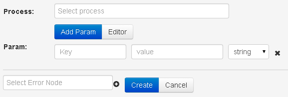
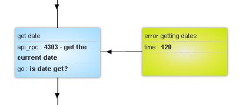

# Logic API RPC

*   **Select process** - choose from dropdown list or code/title of the process, which will be called.
*   **Add Param** - add entering parameter for the called process
*   **Param**
    *   **Key** - name of entering parameter for process
    *   **value** - value of entering parameter. It is possible to put value from request via construction `{{parameter name}}`
*   **Select Error Node** - node in which the request will be conveyed, in case if process was not called. One of the error type – no access to process.

Probable types of errors:

| Parameter name | Value | Description |
| -- | -- | -- |
| `__conveyor_copy_task_result__` | crash_api | Error of the sending the request in RPC process |
| `__conveyor_copy_task_result__` | access_denied | No access to selected process |
| `__conveyor_rpc_return_type_tag__` | rpc_task_fatal_error | Error of request sending in process |
| `__conveyor_rpc_return_type_tag__` | rpc_task_size_overflow | Size of return data exceeds 128 Kb |
| `__conveyor_rpc_return_type_tag__` | rpc_task_wrong_convert_param | Impossible to convert variables into required types |
