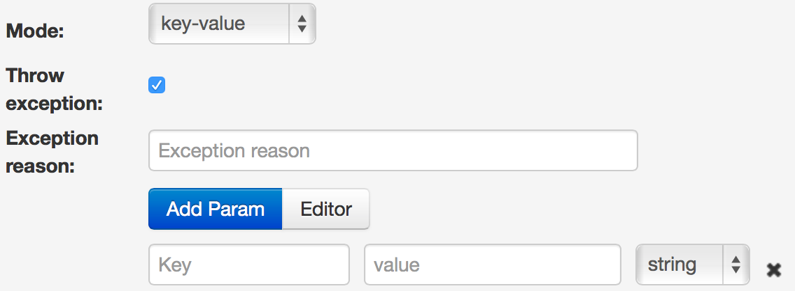
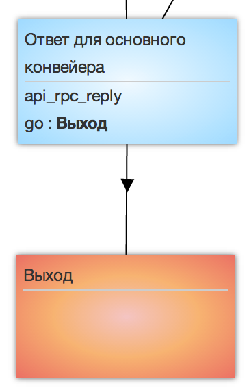

# Logic API RPC reply

Logic recalls operating results of the process as list "Variable=value" to the core process.

*   **Mode** - key/key-value. Mode of value substitution on reply from process.  In case of **key**, you need only to indicate the name of key, value of which will be returned in the reply.  In case of key-value, you need to indicate the parameter name and their values as well
*   **Throw exception** - generate the reply with the error char Yes/No
*   **Exception reason** - text error, that will be returned in the parameter  `__conveyor_rpc_reply_return_description__`
*   **Add Param** - add variable that will be returned to the calling process
*   **Editor** - editor of compound data structures
*   **Key-value** - indicate the field name from request or the value in the field `value`, that will be returned along with the reply.

> Example. Process must find the customer by phone number and return full name and address. In `rpc_reply` should be two `Param` with values:
*   `phone` = `{{phone}}`
*   `fio` = `{{fio}}`

It is recommended to place `api_rpc_reply` before the last (final) node.

Generated errors by logic are returned in the escalation node in the core process. You can find the description of errors in the table about logic RPC.
