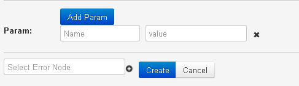
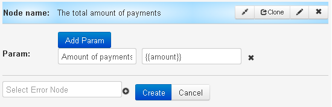

# API sum logic

It allows to sum up values by defined field of request.

* **Name** - parameter name that contains sum of values
* **value** - `{{parameter name}}` from request, the value of which should be summarized.

For example,

 Value of logic API sum can be shown on dashboard.
