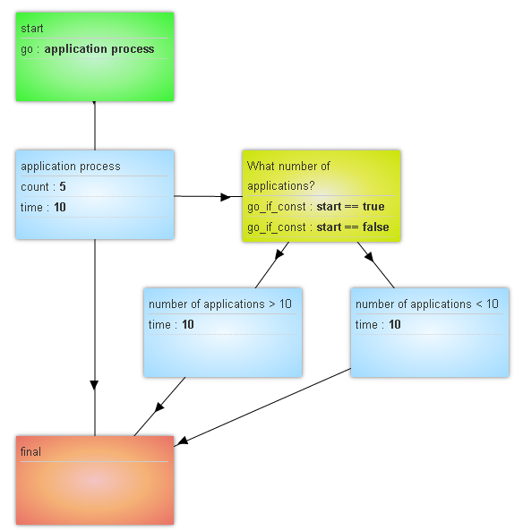

## Time logic

Work logic:

 - `Value logic` is a boundary value in seconds, reaching which a request is automatically moved to escalation node. Possible options: in seconds, iminutes, hours, days {{varibale from the request}} date/time in the format unixtime
 - `Select to go node` and `Select escalation node` are the same at this moment as they specify the node for passing when executing escalation conditions (`Value logic`)

