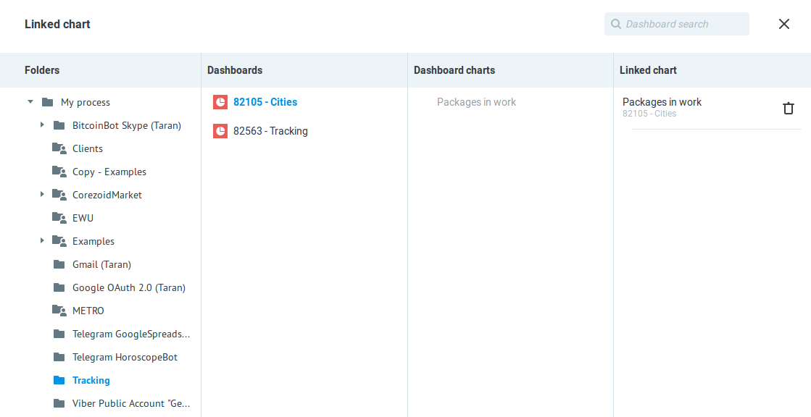

# Dashboards
 
**Dashboard** is a Corezoid tool for collecting process statistics and reports. Data is presented graphically as set of charts.
  
The chart is formed from the nodes of the ready processes. Tasks in the nodes (counters) are the source of data (metric) of the chart.
  
* [Creating a dashboard](#creating-a-dashboard)
* [Chart settings](#chart-settings)
* [Access management](#access-management)
* [Dashboard export](#dashboard-export)
* [Dashboard import](#dashboard-import)
  
  
## Creating a dashboard
  
  
To create a dashboard:
  
* click button **Create**;
* select **Dashboard**;
* enter name and description (optional).
  

  
Created dashboard contains an empty chart which is ready for editing.
  
Button **Save** commits changes in dashboard.
  
Button **Add chart** adds new chart to dashboard.
  

 
## Chart settings
  
### Chart metrics
  
To select the data to be displayed in the chart, click on **"+"** (**Add Metrics**) in **Metrics** settings:
  

The window for selecting the data source for the chart will open.
  

  
**Folders** - select folder with processes;
  
**Processes** - select process;
  
**Process nodes** - process nodes. Button “+” adds it to chart;
  
**Added metrics** - added nodes.
  
Close window with metrics and get customized chart:
  

  
Press button **Save** to commit changes.
  
You can change order of metrics using drag and drop in **Metrics** settings.
  

  
  
### Chart Type
  
Depending on the type of data and the purpose of the chart, you can change the type of the chart. 
  
Available types:
  
* **Bar chart**;
* **Pie chart**;
* **Funnel chart**;
* **Table**.

  
  
### Chart Size
  
To change chart size move the cursor to its left/right corner and set the required size.
    

 
### Range
    
You can set a range of data display on dashboard. Range is applied to all existing charts in it.
  
Pay attention that mode **Real-Time** works correctly only for final nodes (**End: Success**, **End: Error**) and nodes with logics **Waiting for callback**, **Delay** и **Set state** (in state diagram).
This is because tasks in nodes with logics **Waiting for callback**, **Delay**, **Set state** are delayed for the time provided by the process, and in nodes with logics **End: Success** and **End: Error** tasks are accumulated.
Nodes with other logics don’t accumulate tasks. If you select **Real-Time** mode, the chart data will be empty.
  

  
  
### Adding a link to the linked chart
  
If the data has a hierarchical structure, that is, contain nestings, then they can be appropriately detail. Use link to the chart from another dashboard to detail metric.
  
Click on **“🔗” (Add chart link)** in **Metrics** settings to do this.
  

The window for selecting linked chart will open. Select dashboard and chart in it. 
  

  
The selected chart opens in a new tab when you click on the link on the metrics.  
  
## Access management
  
You can share the dashboard in two ways:
  
1) While editing the dashboard click the **Share** button in the upper right corner of the screen.
  

  
Window **Sharing settings** will open. It shows current users and their access rights and you can add new one.
  
If user has been already added to your list, you can search him using first three symbols of name or email. Select user, check his access rights and press button **Send invitation**.
  

  
If user hasn’t been added to your list yet, enter his e-mail, check his access rights and press button **Send invitation**.
  

  
Invited guest will receive e-mail notification of granting access to dashboard.
  

  
Until the user confirms invitation he’ll be marked by “envelope” in the information window.
  
2) Browsing a folder with a dashboard click **Share objects**.
  

  
Window **Sharing settings** will open. It shows current users and their access rights and you can add new in the same way as p.1.
  
  
## Dashboard export
  
You can download dashboard as **json** file as well as other Corezoid objects.

**Notice!** If you want your dashboard to work correctly after downloading the folder must contain dashboard and linked processes/charts. You must export the containing folder.
  
To do export select folder containing dashboard and processes and click **Download**.
  

  
Click **to file** in successful download notification and save file on your hard disk.
  
  
## Dashboard import
  
You can create dashboard from **json** file. In order to do this json file needs to contain folder with dashboard and linked processes/charts.
Press **Create -> From file** and select file in json format in explorer.
  

  
A folder will be created, you can find it in the list of your processes - folder **"My files"**.
 
