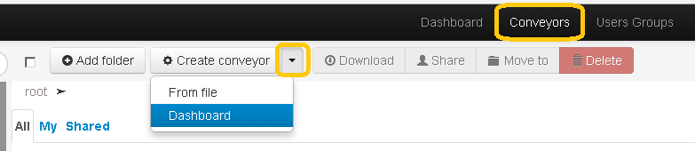
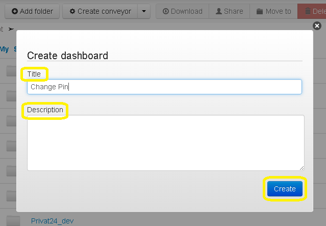
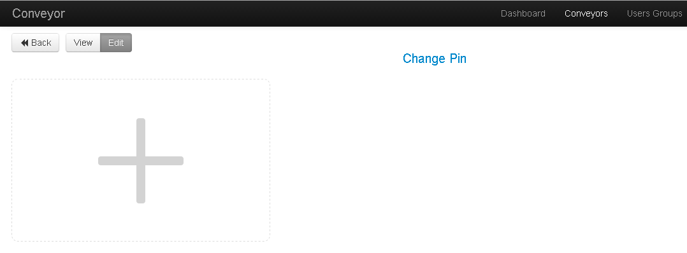
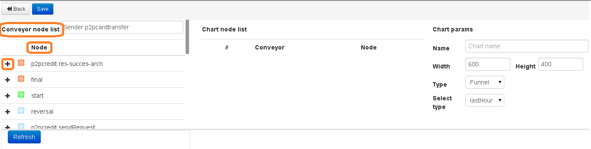
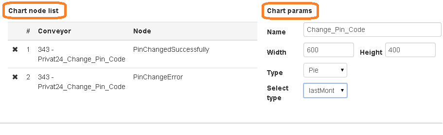
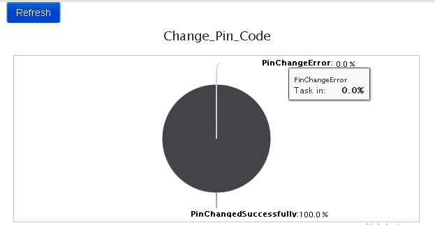

# Creation of dashboard

For creation of new dashboard go to section **Processes**, on button **Create process** click on arrow on the right and choose **Dashboard**.

Then panel **Create dashboard** will be shown  where is essential to enter name of process (for example "Card activation"), its description if necessary and click on **Create**.

- **Title** - title of dashboard
- **Description** -  description of dashboard

Now choose process and its nodes  clicking on the button with big plus

Then in the line **Select process** enter id of the process and choose it from the drop-down list

After choosing of process in column **Node** the list of all nodes for this process will be displayed. Using **"+"** opposite to each node you can add all what you need for formation of your dashboard.

After adding the node it will be shown in column **Chart node list**.

Then choose parameters of the graph in column **Chart params**.

- **Name** - title of the graph
- **Width** - width
- **Height** - height
- **Type** - type of the graph (funnel, column, pie-chart)
- **Select type** - period of time on which we want to get statistics

For creation of dashboard click on the button **Refresh**.

And receive ordered dashboard.

It is obligatory click on **Save** for saving the results.

You can find created dashboard in the list of your processes – in folder **"root"**.
