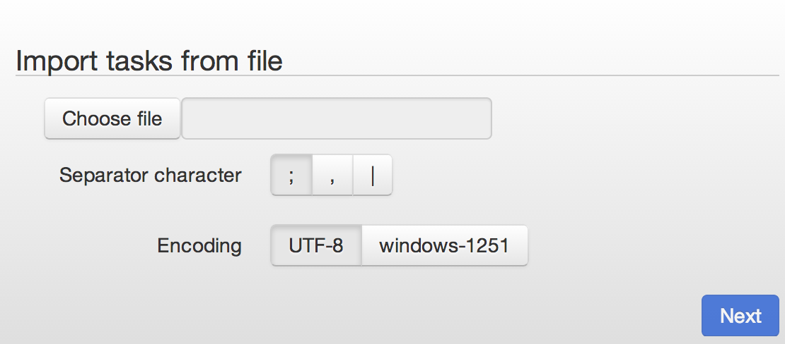
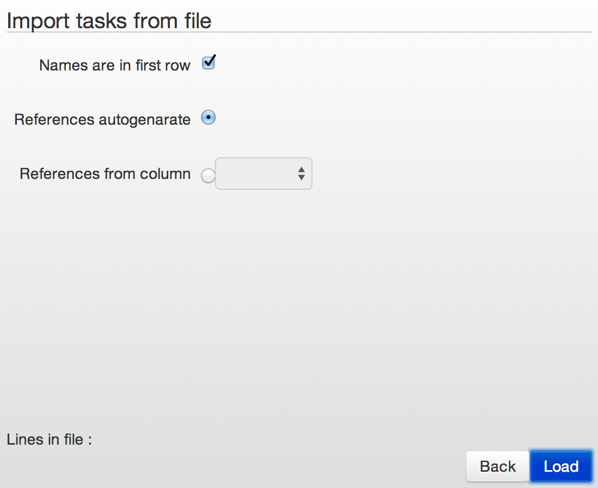

# Uploading date from file

[Uploading data through API](../api/upload_modify.md)

----

## Select a file to upload it to process
1.  File format - text
2.  File extention - any
3.  Columns separators `Separator`:
    *   ;
    *   ,
    *   |
4.  File encoding `Encoding`:
    *   UTF-8
    *   windows-1251

## Set a data import from files
1.  `Names are in first row` - does first line contain names of the fields? Yes/No
2.  Reference `References` generate by every record:
    *   automaticly `autogenerate`
    *   from column `from column` - select a column
3. `Load` - upload file into process
4. **Maximum amount of records in one file - 100 000.**

## Upload file result

1.  Total - total amount of records in file
2.  Sent - sent to process
3.  Success - successfully uploaded to process
4.  Error - failed to upload

