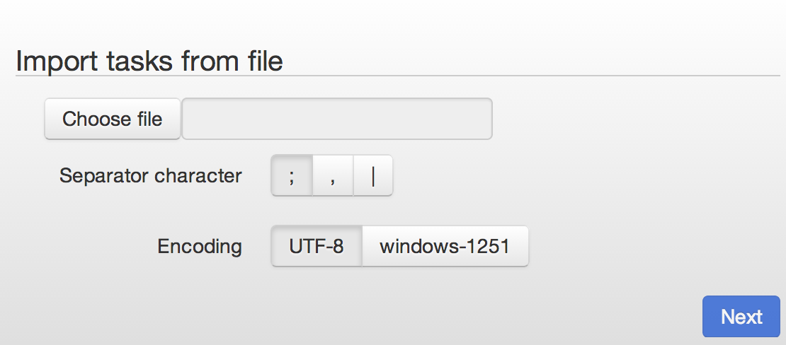
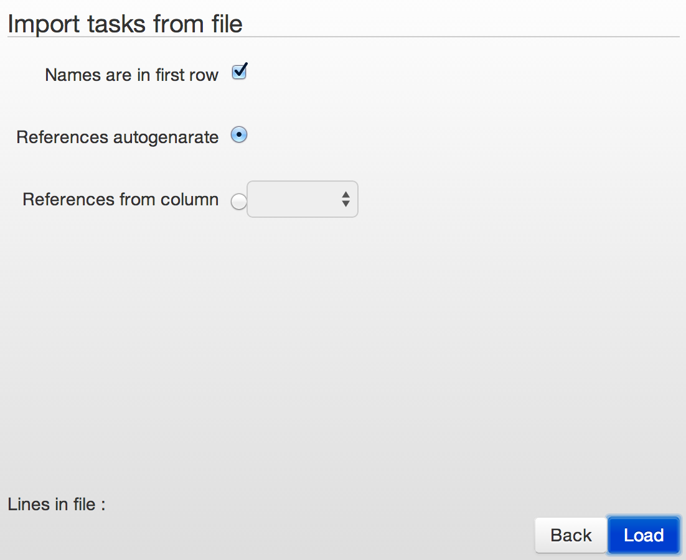
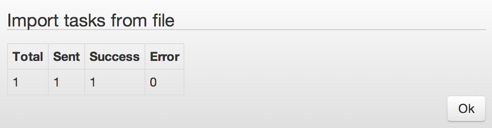

# Data uploading from file

[Data uploading through API](../../api/v1/upload-modify.md)

## Choosing of the file for uploading to process
1.  Format of the file – text
2.  File extension – any
3.  Column separator `Separator`:
    *   ;
    *   ,
    *   |
4.  File coding `Encoding`:
    *   UTF-8
    *   windows-1251

## Settings of the data import from file
1.  `Names are in first row` - does the first line of the file consist of fields name? Yes/No
2.  Reference `References` for each recording generate:
    *   automatically `autogenerate`
    *   `from column` - choose from which column
3. `Load` - downloading of the file to process
4. ** Maximum quantity of recordings in one file - 100 000.**

## Results of file uploading

1.  Total – total number of recordings in file
2.  Sent – sent to process
3.  Success – successfully uploaded to process
4.  Error – uploading was failed

