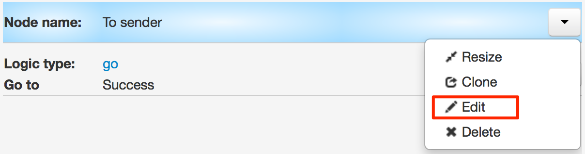
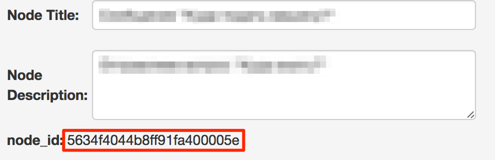

# Node parameters reading

##Count
Depending on the number of task in the node you can customize business-process logic.

Returns amount of tasks through node ID.

Example:

    // ID_узла = 561a272782ba961374d44178

        {{node[561a272782ba961374d44178].count}}

    // Returns amount of tasks in the node specified by the parameter {{node_id}}

        {{node[{{node_id}}].count}}

    // Returns amount of tasks in the node specified by the parameter {{node_id}} from {{conv_id}} process

        {{conv[{{conv_id}}].node[{{node_id}}].count}}

##Sum
Returns the summation value of selected task parameter.

Example:

    // ID_узла = 561a272782ba961374d44178

        {{node[561a272782ba961374d44178].SumID}}

    // Returns amount by SumID parameter from node {{node_id}}

        {{node[{{node_id}}].SumID}}

    // Retuns amount by SumID parameter from {{node_id}} from {{conv_id}} process

        {{conv[{{conv_id}}].node[{{node_id}}].SumID}}

##How to get nodes ID?

