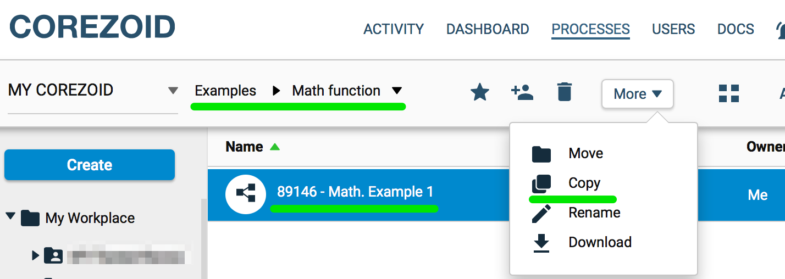
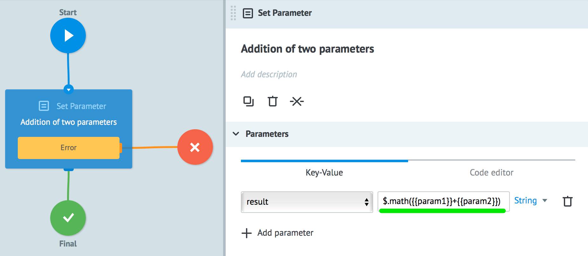
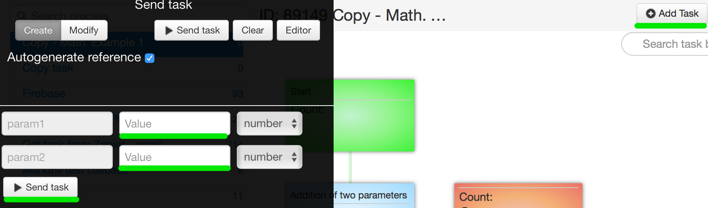
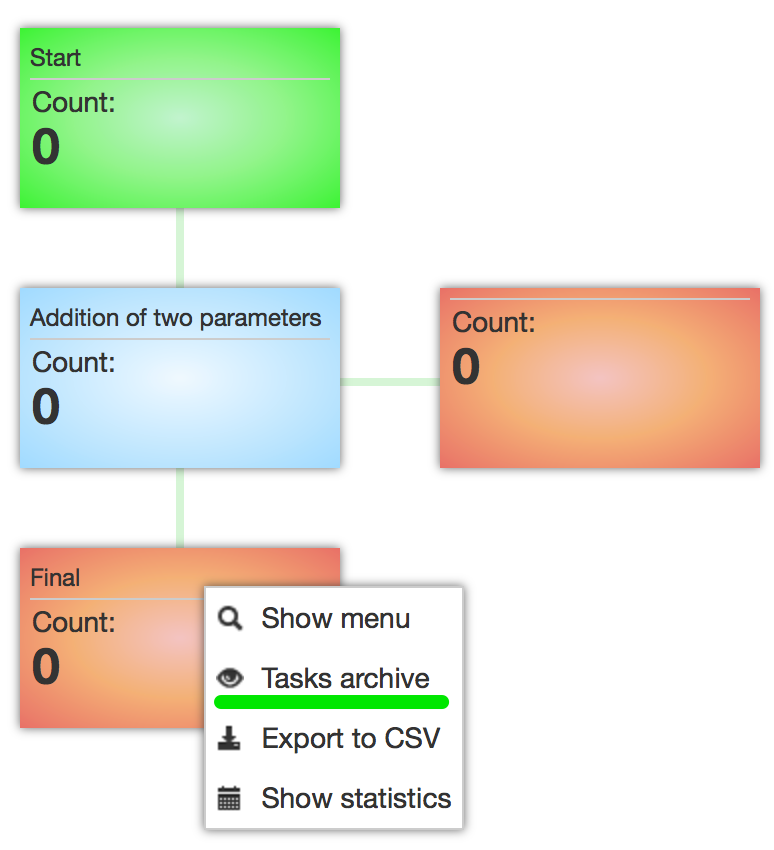
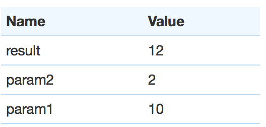

# Mathematical

##$.math()

Returns result of mathematical actions addition, subtraction, multiplication and division of constants and / or parameters.
Examples:

    // Returns an amount qual to 22

        $.math(1+1)

    // Returns the sum of parameters + 10

        $.math({{parameter_name}}+10)

    // Returns the difference of two parameters

        $.math({{parameter_name1}}-{{parameter_name2}})

###Example: addition of two parameters from task.
To test [process example](https://admin.corezoid.com/editor/55348/89146) follow this:
1.  Go to [Examples/Math function](https://admin.corezoid.com/folder/conv/55348)
2.  Make a copy of process

3.  In **Addition of two parameters** node it is formula specified **$.math({{param1}}+{{param2}})**  which result is saved to **result**  variable

4.  Go to **View** mode and press  **Add task** button to send text task.

5.  Select final node and and **task archive** point in order to see working process result

6.  Working process result

