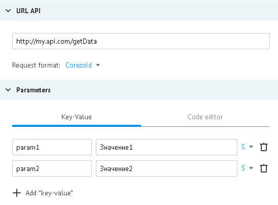

# COREZOID format

Data for example:

- URL - http://my.api.com/getData
- input parameters - `"param1":"Значение1"`, `"param2":"Значение2"`



**Request from the process to API**
*   http://my.api.com/getData?conv_signature={SIGNATURE}&conv_time={GMT_UNIXTIME}&conv_id={CONV_ID}

Parameters `conv_signature`, `conv_time` and `conv_id` are automatically added to URL and can be used for access verification.

`conv_signature` is formed according to [formula](../../../api/v1/spec.md), where `API_SECRET` -  is a key which is generated in the node with API logic.

**Request body**

```json
{
  "ops": [
    {
      "ref": "130605",
      "type": "data",
      "obj_id": "t71001",
      "conv_id": "1234",
      "node_id": "n10221",
      "data": {
        "phone": "380501234561",
        "card": "4134000011112221"
      },
      "extra": {
        "param1": "Значение1",
        "param2": "Значение2"
      }
    }
  ]
}
```

Called process should take parameters from `extra` block, variables in `data` can be missing.

**If a request succeeds, it will return HTTP status code 200:**

```json
{
  "request_proc": "ok",
  "ops": [
    {
      "ref": "130605",
      "obj_id": "t71001",
      "proc": "ok",
      "res_data": {
        "res": "0"
      }
    }
  ]
}
```

**If a request fails, HTTP status code 500 will be returned:**
```json
{
    "request_proc":"ok",
    "ops":[
        {
            "ref":"130605",
            "obj_id":"t71001",
            "proc":"fail",
            "res_data":{
                "error":"Text error"
                }
        }
    ]
}
```

`res_data` content is automatically added to the task in process (to `data) therefore task will contain new parameter `result="0"`
