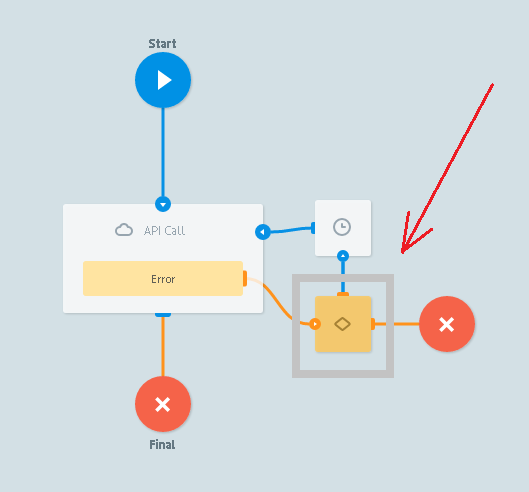

# Errors codes

### Succesfull API Call

- **HTTP code** от API:
    -   200
    -   201
    -   202
- `Content-type` = `aplication/xml` the response will be automatically converted from XML to JSON and added to task
- `aplication/json` - object. All parameters from  will be added to that task as it is
- `aplication/json` - array. Array will be added to the task as `__conveyor_api_array__` parameter
- `image` will be converted into base64 and added to the task as `__conveyor_api_image__` parameter

<section id="create_task_error" />

### Error processing

In case of errors the task goes to the node with Condition logic

with additional parameters of the error:

| Parameters name | Parameters description |
| --- | --- |
| `__conveyor_api_return_type_error__` | error type (hardware/software)|
| `__conveyor_api_return_type_tag__` | error code |
| `__conveyor_api_return_type_description__` | error description |

<bookmark id="error">

### Error types

#### Request to API has been waiting for a long time. All connects to API (max_threads) have been used or API does not answer for a long time.

| Parameter name | Value |
| --- | --- |
| `__conveyor_api_return_type_error__` | hardware |
| `__conveyor_api_return_type_tag__` | api_expire_query |
| `__conveyor_api_return_description__` | Expire task to API, please check your api for correct answer, or increase max_threads for connections` |

#### Failed to add the parameters to the query

| Parameter name | Value |
| --- | --- |
| `__conveyor_api_return_type_error__` | hardware |
| `__conveyor_api_return_type_tag__` | api_bind_error |
| `__conveyor_api_return_description__` | Error bind params to http query |

#### Internal process error

| Parameter name | Value |
| --- | --- |
| `__conveyor_api_return_type_error__` | hardware |
| `__conveyor_api_return_type_tag__` | api_fatal_error |
| `__conveyor_api_return_description__` | Error running api |

#### Did not wait/receive a response from API

Maximum time to wait for a response from API = **60 sec**. After this time task goes to the **Escalation** node.

| Parameter name | Value |
| --- | --- |
| `__conveyor_code_return_type_error__` | software |
| `__conveyor_api_return_type_tag__` | api_bad_answer |
| `__conveyor_api_return_description__` | timeout or failed_connect |

#### Not valid JSON

| Parameter name | Value |
| --- | --- |
| `__conveyor_api_return_type_error__` | software |
| `__conveyor_api_return_type_tag__` | api_no_valid_json |
| `__conveyor_api_return_description__` | Please check |

#### Empty URL for API Call

| Parameter name | Value |
| --- | --- |
| `__conveyor_code_return_type_error__` | software|
| `__conveyor_api_return_type_tag__` | api_bad_answer |
| `__conveyor_api_return_description__` | no_scheme |

#### Wrong `request_proc` in reply

| Parameter name | Value |
| --- | --- |
| `__conveyor_api_return_type_error__` | software |
| `__conveyor_api_return_type_tag__` | api_no_request_proc |
| `__conveyor_api_return_description__` | Bad request_proc tag. Please fill request_proc=ok for your answer. If you want to put error use proc!=ok |

#### Reply does not contain `ops` block

| Parameter name | Value |
| --- | --- |
| `__conveyor_api_return_type_error__` | software |
| `__conveyor_api_return_type_tag__` | api_no_ops |
| `__conveyor_api_return_description__` | No ops. Please check documentation |

#### Failed to convert parameters

| Parameter name | Value |
| --- | --- |
| `__conveyor_api_return_type_error__` | software |
| `__conveyor_api_return_type_tag__` | api_wrong_convert_param |
| `__conveyor_api_return_description__` | Param: ___, Value: ____, Try convert to: |

#### API reply contains wrong res_data

| Parameter name | Value |
| --- | --- |
| `__conveyor_api_return_type_error__` | software |
| `__conveyor_api_return_type_tag__` | api_bad_res_data |
| `__conveyor_api_return_description__` | Bad res_data: ", Data/binary, ". Please check documentation |

#### API response is more than 128kB

| Parameter name | Value |
| --- | --- |
| `__conveyor_api_return_type_error__` | software |
| `__conveyor_api_return_type_tag__` | api_task_size_overflow_limit |
| `__conveyor_api_return_description__` | Your task size: {{size_data}} bytes, Max available task size: 128000 bytes, Try to change your data or try to split your task ... |

