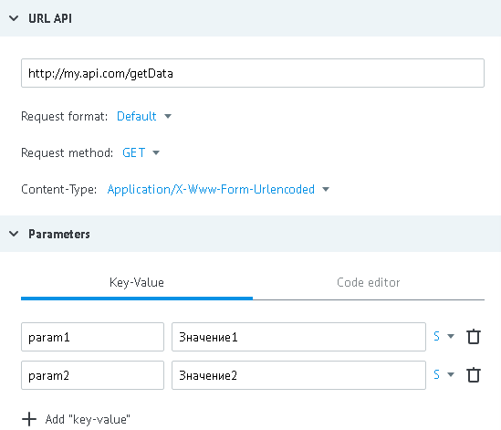

# GET method

Data for example:

- URL - http://my.api.com/getData
- incoming parameters - `"param1":"Value1"`, `"param2":"Value2"`



**GET request from process to API**

*   http://my.api.com/getData?param1=%D0%97%D0%BD%D0%B0%D1%87%D0%B5%D0%BD%D0%B8%D0%B51&param2=%D0%97%D0%BD%D0%B0%D1%87%D0%B5%D0%BD%D0%B8%D0%B52

or

*   http://my.api.com/getData?param1=%D0%97%D0%BD%D0%B0%D1%87%D0%B5%D0%BD%D0%B8%D0%B51&param2=%D0%97%D0%BD%D0%B0%D1%87%D0%B5%D0%BD%D0%B8%D0%B52&conv_signature={{conv_signature}}&conv_time={{conv_time}}&conv_id={{conv_id}}

Parameters `conv_signature`, `conv_time` and `conv_id` can be added to URL and used for verification of access to called API.

`conv_signature` is formed according to [formula](../../../api/spec.md), where `API_SECRET` - is a key which is generated in the node with API logic.

**Reply to the process with successful operation processing (HTTP status code = 200):**
```json
{
    "answerParam":"ok"
}
```

**In case of server error (HTTP status code = 500), reply to the process :**
```json
{
    "textError":"Text error",
    "codeError":"Code Error"
}
```

`json` content is automatically added to the task in process (in data object).


