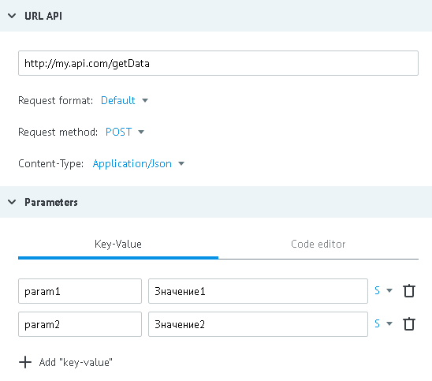
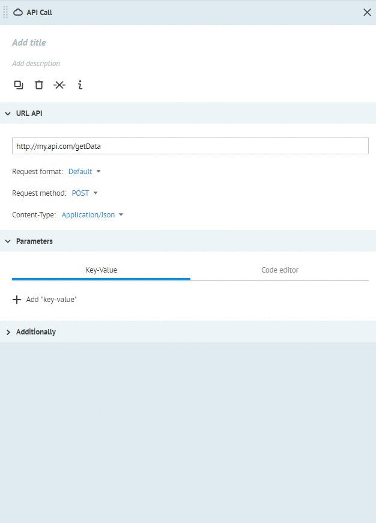
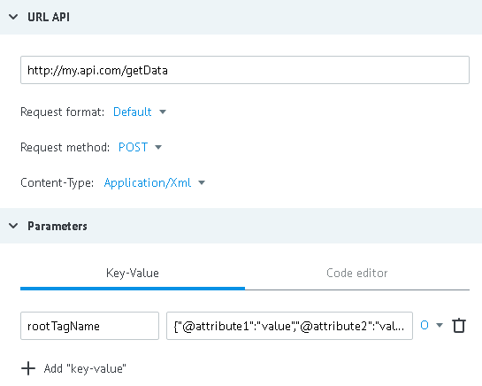
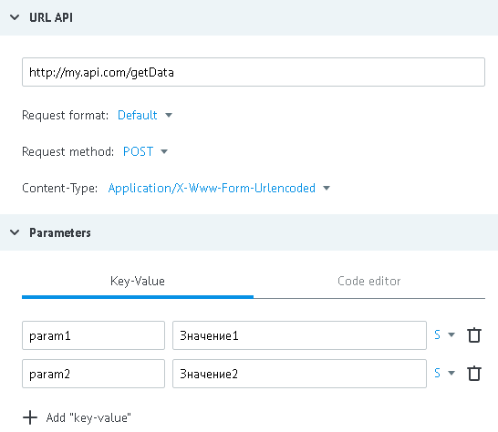

# POST method

**POST** is used for requests to API in formats:
*   [JSON](#json-post)
*   [XML / SOAP](#xml)
*   [NVP (x-www-form-urlencoded)](#nvp)

## JSON
**Content-type = application/json**

Data for example:

- URL - http://my.api.com/getData
- incoming parameters - `"param1":"Value1"`, `"param2":"Value2"`



**POST request from process to API**

*   http://my.api.com/getData

or

*   http://my.api.com/getData?conv_signature={{conv_signature}}&conv_time={{conv_time}}&conv_id={{conv_id}}

`conv_signature`, `conv_time` and `conv_id` parameters can be added to URL and used for verification of access to caled API.

`conv_signature` is forming according to [formula](../../../api/v1/spec.md), where `API_SECRET` - is a key that was generated in the node with API logic.

**Request body**
```json
{
    "param1":"Value",
    "param2":"Value"
}
```
or

```json
{
    "param1":"Value",
    "param2":"Value",
    "sys":
    {
        "ref":"130605",
        "obj_id":"53c29d228245aa58be013acf",
        "conv_id":672,
        "node_id":"53c01daa8245aa58be00e889"
    }
}
```

**Reply to process with successful operation processing (HTTP status code = 200):**
```json
{
    "answerParam":"ok"
}
```

**In case of server error (HTTP status code = 500), reply to process :**
```json
{
    "textError":"Text error",
    "codeError":"Code Error"
}
```

Reply from API is automatically added to the task  in process (to data object).
 
## XML
Variants **Content-type** for work with XML:
*   application/xml
*   text/xml
*   soap/xml

Data for example:
- URL - http://my.api.com/getData
- xml request:
```xml
<rootTagName attribute1="value" attribute2="value">
    <includedTag inclAttr1="val" inclAttr2="value">
        sometextvalueinTag
    </includedTag>
</rootTagName>
```

There's only one parameter transfers to xml requests - it is xml document root tag.
Its value is its structure in json (object or data massive).

Converting of presented request into json:
```json
{
  "rootTagName": {
    "@attribute1": "value",
    "@attribute2": "value",
    "includedTag": {
      "@inclAttr1": "value",
      "@inclAttr2": "value",
      "#value": "sometextvalueinTag"
    }
  }
}
```

where,

`rootTagName` - root tag of xml document

`@attribute1`, `@attribute2` - current tag attributes

`includedTag` - included tag

`@inclAttr1`, `@inclAttr2` - included tag attributes 

`#value` - text content of included tag

Convertation from `XML` to `JSON` is possible automatically on Corezoid side. For this, it is enough to select appropriate XML `(text/xml ; application/xml; application/soap+xml)` from Content-type and put your `XML` in CodeEditor of API CALL node




> Or you can convert XML to JSON for Corezoid by yourself using [freeformatter](http://www.freeformatter.com/xml-to-json-converter.html) sevice. You need only to replace value in `#text property name:` field with `#text` by `#value`

Customize API logic



**POST request from process to API**

*   http://my.api.com/getData

or

*   http://my.api.com/getData?conv_signature={{conv_signature}}&conv_time={{conv_time}}&conv_id={{conv_id}}

`conv_signature`, `conv_time` and `conv_id` parameters may be added to URL and used for verification of access to called API.

`conv_signature` is formed according to [formula](../../../api/v1/spec.md), where `API_SECRET` - is a key which was generated in node with API logic

**Request body**
```xml
<?xml version="1.0" encoding="UTF-8" ?>
<rootTagName attribute1="value" attribute2="value">
    <includedTag inclAttr1="value" inclAttr2="value">
        sometextvalueinTag
    </includedTag>
</rootTagName>
```

**Reply to the process with successful operation processing (HTTP status code = 200):**
```json
{
    "answerParam":"ok"
}
```

**In case of server error (HTTP status code = 500), reply to the process :**
```json
{
    "textError":"Text error",
    "codeError":"Code Error"
}
```

Reply from API in XML fromat will be automatically recognized and converted in case if **HEADER** will contain **Content-type** parameter with one of values:
*   application/xml
*   text/xml
*   soap/xml

Otherwise, reply will not be recognized and task will not go to the handling errors branch. 
## NVP
**Content-type = application/x-www-form-urlencoded**

Data for example:

- URL - http://my.api.com/getData
- incoming parameters - `"param1":"Value1"`, `"param2":"Value2"`



**POST request from process to API**

*   http://my.api.com/getData

or

*   http://my.api.com/getData?conv_signature={{conv_signature}}&conv_time={{conv_time}}&conv_id={{conv_id}}

`conv_signature`, `conv_time` and `conv_id` parameters may be added to URL and used for verification of access to called API

`conv_signature` is formed according to [formula](../../../api/v1/spec.md), where `API_SECRET` - is a key which was generated in node with API logic

**Request body**
```
param2=%D0%97%D0%BD%D0%B0%D1%87%D0%B5%D0%BD%D0%B8%D0%B52&param1=%D0%97%D0%BD%D0%B0%D1%87%D0%B5%D0%BD%D0%B8%D0%B51
```

**Reply to the process with successful operation processing (HTTP status code = 200):**
```json
{
    "answerParam":"ok"
}
```

**In case of server error (HTTP status code = 500), reply to the process :**
```json
{
    "textError":"Text error",
    "codeError":"Code Error"
}
```

`json` content is automatically added to the task in process (to data object).
