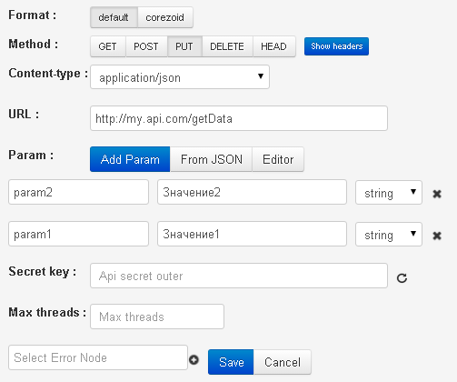

# PUT / DELETE / HEAD / PATCH

Data for example:

- URL - http://my.api.com/getData
- input parameters - `"param1":"Значение1"`, `"param2":"Значение2"`



**Request from process to API**

*   http://my.api.com/getData

or

*   http://my.api.com/getData?conv_signature={{conv_signature}}&conv_time={{conv_time}}&conv_id={{conv_id}}

`conv_signature`, `conv_time` and `conv_id` can be added to URL and used for verification of access to  API.

`conv_signature` is formed according to [formula](../../../api/v1/spec.md), where `API_SECRET` - is a key which is generated in the node with API logic.

**Request body**
```json
{
    "param1":"Value",
    "param2":"Value"
}
```
or

```json
{
    "param1":"Value",
    "param2":"Value",
    "sys":
    {
        "ref":"130605",
        "obj_id":"53c29d228245aa58be013acf",
        "conv_id":672,
        "node_id":"53c01daa8245aa58be00e889"
    }
}
```

If a request succeeds, it will return **HTTP status code 200** + any valid `json`, which is automatically added to the task (to data object).

```json
{
    "answerParam":"ok"
}
```

If a request fails, **HTTP status code 500** will be returned:
```json
{
    "textError":"Text error",
    "codeError":"Code Error"
}
```
