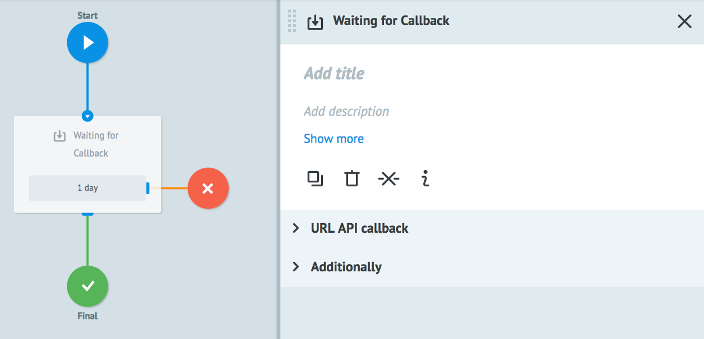
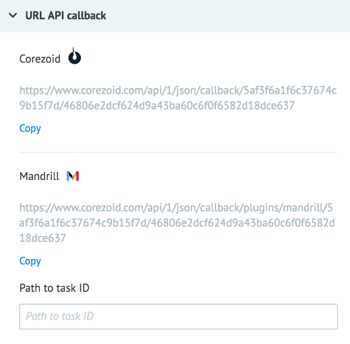
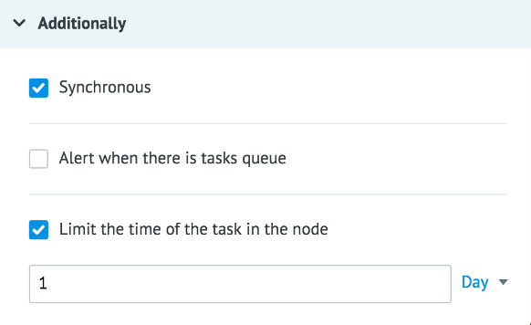
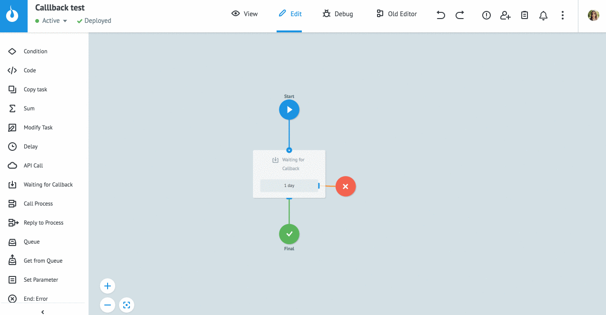
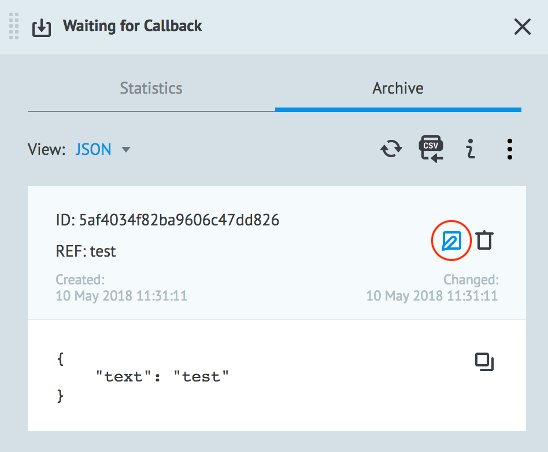
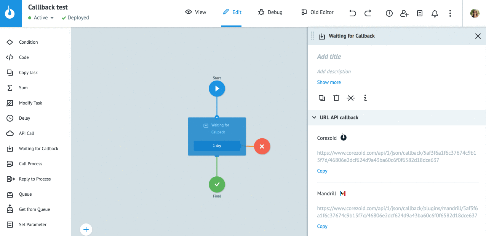

# Waiting for Callback logic

Waiting for callback form external system.

Task goes to node and "freezes" for getting callback from external system or another process.

## URL API callback

**Corezoid (copy)** - URL for getting callback specifically in this node

**Mandrill (copy)** - URL for getting callback from [Mandrill](https://mandrillapp.com/login/?referrer=%2Ftemplates) (specifically in this node)

**Path to task ID** - input field for parameter name from request body which is contain the `task_id`

To modify task you need to send [request](callback.md#callback-url) (POST) to the callback URL which is copied from node.

## Additionally

#### Synchronous

This option gives a possibility to modify tasks synchronously. This option is enabled by default.

If you update task from external system with [request to Callback URL](callback.md#callback-url) and the task isn't in the current node you'll get an error `task_not_in_current_sync_callback_node`.

If option **Synchronous** is disabled and the task isn't in the current node, the request will be successful.

#### Alert when there is tasks queue

Critical amount of tasks in the node.

Learn more about how it works [here](timer.md).

#### Limit the time of the task in the node

Time interval value at which task will go further through process in case if task is not modified.

Learn more about how it works [here](timer.md).

It is required to specify limit so that applications do not hang in the node forever.

## Modifying task

There are 3 variants of how data may be updated:
* Manually from the interface
* From another process with logic [Modify](https://doc.corezoid.com/en/interface/nodes/logika_modify_task.html) or using [API Corezoid](https://doc.corezoid.com/ru/api/upload_modify.html) `"type":"modify", "obj":"task"`
* Request to Callback URL

### Manually

To modify task from the interface:

* Switch process to **View** mode.
* Press button **+ New task**.
* Select mode **Modify**, enter task reference and new parameters.
* Press **Add task**.

To modify task quickly from **Task Archive** there is a special button **Modify**.

### Modify Task logic

Modifying task from another process with [Modify Task](logika_modify_task.md) logic:

You need to select process, enter task reference and add parameters.

### API Corezoid

To modify task from external system make a [modify](https://doc.corezoid.com/ru/api/upload_modify.html) request.

You can use "task_id" parameter instead of "ref".

### Callback URL

To modify task from external system you can making request to Callback URL of the node.

Example of the request via **Postman**:

