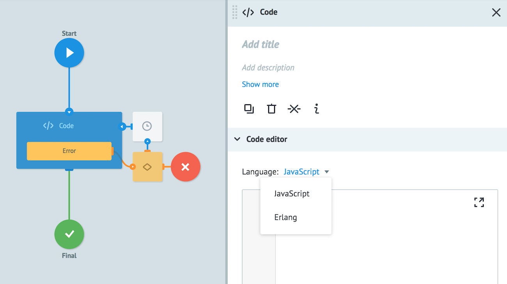
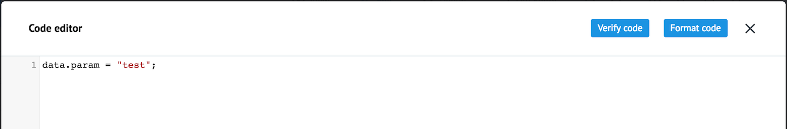
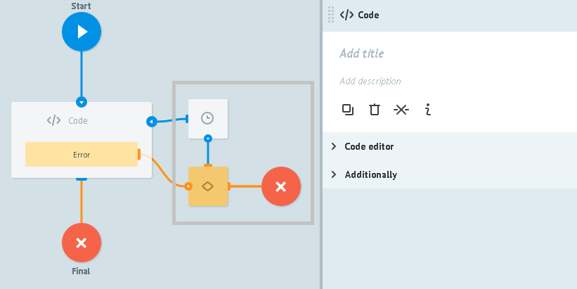

# Code

Logic allows you to implement additional processing of tasks in one of the programming languages (JavaScript, Erlang).




## Code editor

Here you can select programmimg language and enter a code.

### Language

Selection of the programmimg language:

* **JavaScript**

[Available JavaScript libraries](function_code.md).

Google V8 ver. 4.x is used

**Task parameters in Javascript code** denoted by "data." - `data.variable_name`.

For example, `data.phone = '+1xxx';` creates or modifies value of the parameter `phone` to `+1xxx`

* **Erlang**

**Task parameters in Erlang code**  are created or modified with a help of specifying module with any name and one `main` function export.

For example, next code adds `param` parameter to the task
```
-module(node).
-export([main/1]).
main(Data) -> [{<<"param">>, <<"Hello World!!!">>} | Data].
```

You can expand **Code editor** for easy operation:



Button **Verify code** checks code syntax.

Button **Format code** - formatting the code according to the standards of the selected programming language.


## Additionally


### Alert when there is tasks queue

Critical amount of tasks in the node.

Detailed [description](timer.md#tasks-limit) of logic work.

### Limit the time of the task in the node

Time value parameter at which task will go further in case if API code logic do not reply.

Detailed [description](timer.md#timer) of logic work.


## Errors processing



Nodes, which are marked with grey square, are added automatically to process errors which appeared in Code logic work.

If the error appears process sends the task to a node with Condition logic and adds following parameters и добавляет к ней следующие параметры:


  1.  `__conveyor_code_return_type_error__` - error type
    -  **hardware** - perform in-process error
    -  **software** - error when calling the API
  2.  `__conveyor_code_return_type_tag__` - error code
  3.  `__conveyor_code_return_type_description__` - error description

Maximum execution time of one instance of the code is **5 seconds**, after this time the user will get an error in the format described in p.1 with **hardware** value.

### Error types

#### Timeout of custom code performing

| Parameter_name | Value |
| --- | --- |
| `__conveyor_code_return_type_error` | hardware |
| `__conveyor_code_return_type_tag__` | code_timeout |
| `__conveyor_code_return_description__` | timeout for executing code |

#### Error of user's code performing
| Parameter_name | Value |
| --- | --- |
| `__conveyor_code_return_type_error` | software |
| `__conveyor_code_return_type_tag__` | code_executing_error |
| `__conveyor_code_return_description__` | error text |

#### Incorrect format of user's code reply
| parameter_name | value |
| --- | --- |
| `__conveyor_code_return_type_error` | software |
| `__conveyor_code_return_type_tag__` | code_return_format_error |
| `__conveyor_code_return_description__` | error_text |

