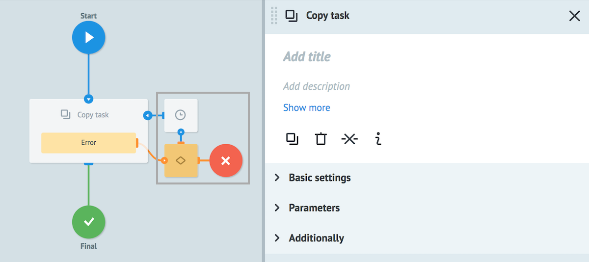

# Copy task logic

Allows to copy the whole task or just a part of task to an available process.

Nodes in the gray box are added automatically for error handling.

## Basic settings

**Process** - selection of a process for copying from "tree of folders". It can be found by its name or its ID or using the  `{{conv_id}}` (parameter of the task).

**Reference** - the reference of a new task that is created in another process.

New task reference can be specified by:
* any [system parameter](https://doc.corezoid.com/en/interface/tasks/task_archive.html#system-parameters). For example, `{{root.ref}}` or `{{root.task_id}}`
* any other task parameter `{{parameter_name}}`
* constant. For example, config, ref etc.

**Copy all parameters** - this option gives a possibility to copy all parameters to a new task.

## Parameters

Button **+ Add "key-value"** - adding new parameter

`Key` - new parameter name

`Value` may contain:
- constant
- `{{parameter_name}}` from task, which value can be pasted
- any system parameter. For example, `{{root.create_time}}` or `{{root.conv_id}}`

If **Copy all parameters** flag is enabled, it is not required to add new parameters.

Otherwise be sure to add at least one parameter.

## Additionally

#### Alert when there is tasks queue

Critical amount of tasks in the node.

Learn more about how it works [here](timer.md).

#### Limit the time of the task in the node

Time interval value at which task will go further through process in case if Copy task logic does not reply.

Learn more about how it works [here](timer.md).

## Types of error

### Internal system error when copying

| Parameter name | Value |
| --- | --- |
| __conveyor_copy_task_return_type_error__ | hardware |
| __conveyor_copy_task_return_type_tag__ | copy_task_fatal_error |
| __conveyor_copy_task_return_description__ | Error running copy task |

| Parameter name | Value |
| --- | --- |
| __conveyor_copy_task_return_type_error__ | hardware |
| __conveyor_copy_task_return_type_tag__ | crash_api |
| __conveyor_copy_task_return_description__ | Error copy_task request |

| Parameter name | Value |
| --- | --- |
| __conveyor_copy_task_return_type_error__ | hardware |
| __conveyor_copy_task_return_type_tag__ | copy_task_timeout |
| __conveyor_copy_task_return_description__ | timeout for executing copy_task request |

### Not a unique reference

| Parameter name | Value |
| --- | --- |
| __conveyor_copy_task_return_type_error__ | software |
| __conveyor_copy_task_return_type_tag__ | not_unical_ref |
| __conveyor_copy_task_return_description__ | not unical reference |

### Incorrect parameters

| Parameter name | Value |
| --- | --- |
| __conveyor_copy_task_return_type_error__ | software |
| __conveyor_copy_task_return_type_tag__ | wrong_validate_params |
| __conveyor_copy_task_return_description__ | Param: <name>, Error: <error> |

> Failed to validate one of the parameters.

### Failed to convert parameter

| Parameter name | Value |
| --- | --- |
| __conveyor_copy_task_return_type_error__ | software |
| __conveyor_copy_task_return_type_tag__ | copy_task_wrong_convert_param |
| __conveyor_copy_task_return_description__ | Param: <name>, Value: <value>, Try convert to: <type> |

> For example, you parameter type is **Number**, but value is string or parameter is missed.

### Inactive process

| Parameter name | Value |
| --- | --- |
| __conveyor_copy_task_return_type_error__ | software |
| __conveyor_copy_task_return_type_tag__ | conveyor_is_not_active |
| __conveyor_copy_task_return_description__ | conveyor is not active |

> Process must be in the **Active** state.

### Access is denied

| Parameter name | Value |
| --- | --- |
| __conveyor_copy_task_return_type_error__ | software |
| __conveyor_copy_task_return_type_tag__ | access_denied |
| __conveyor_copy_task_return_description__ | user: <user_id>, conv_id: <proc_id> |

> User must have **Task management** [access](https://doc.corezoid.com/ru/interface/users_groups.html) to copy task.

### Task size overflow

| Parameter name | Value |
| --- | --- |
| __conveyor_copy_task_return_type_error__ | software |
| __conveyor_copy_task_return_type_tag__ | copy_task_size_overflow_limit |
| __conveyor_copy_task_return_description__ | Your task size: <size> bytes, Max available task size: <max_size> bytes, Try to change your data or try to split your task |

> Maximum allowed size - **128 Kb**.