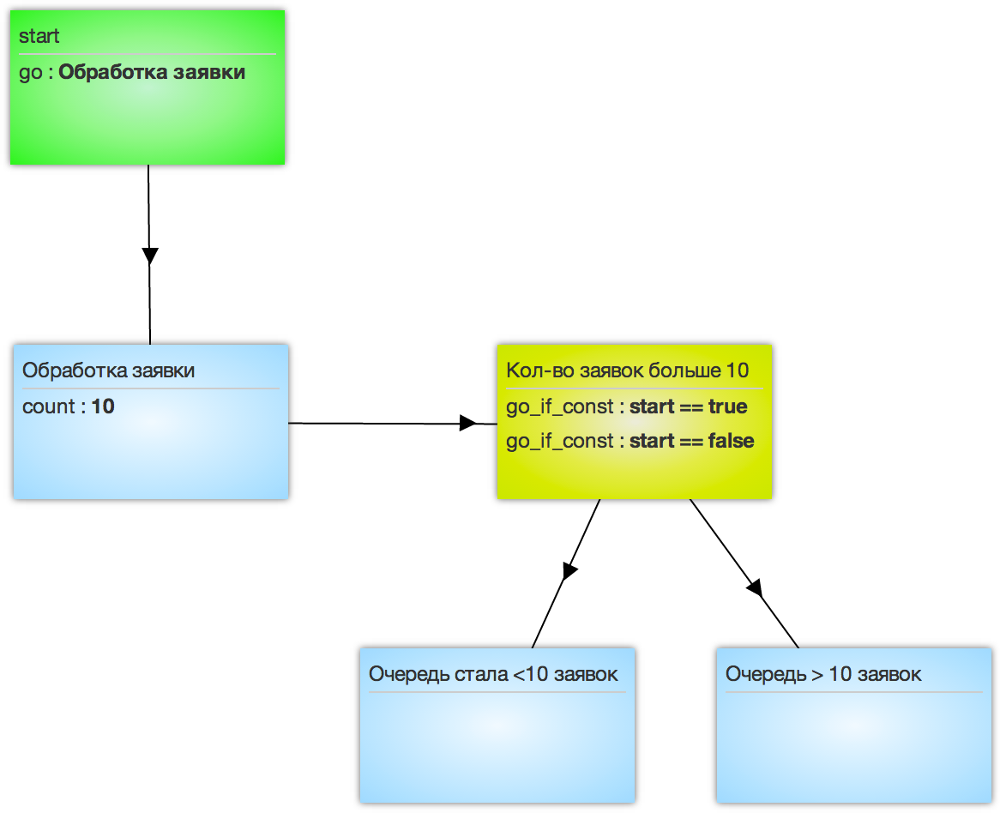

## COUNTER Logic

Work logic:

 - if the specified in the `Value Semafor` field "Critical amount of tasks in the node" value is reached or exceeded, the `start=true` signal comes to escalation node, that indicates about escalation start
 - when amount of tasks in node is dicreased below critical level, there's an automatic `start=false` signal is sent to escalation node to close the escalation.

