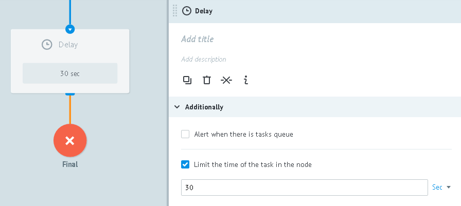
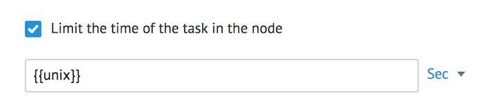
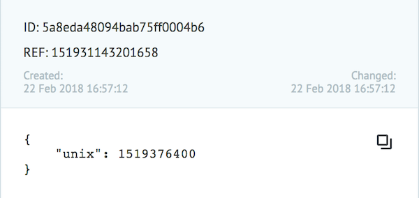
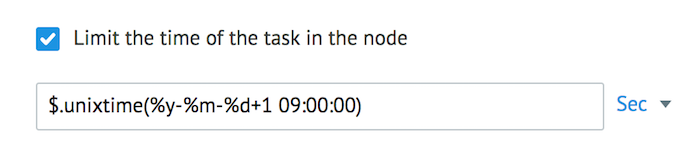

# Delay logic

Used to delay the task in the node for the specified time.

Time interval (delay) is specified the field **Limit the time of the task in the node**.

After the time expires, the task goes to the specified node.

This value can be specified with:

* exact number and unit of measurement - seconds (min 30), minutes, hours, days.

* task parameter:

This task parameter must contain date/time in **unixtime** format.
At the specified time the task goes to a specified node.

* function `$.unixtime()` to get the Unix timestamp of the exact time

If the process is highly loaded, value **60 seconds** for **Delay** logic is recommended

## Example of a dynamic timer for each task

See [an example](https://admin.corezoid.com/editor/102672/156747), where:
*   variable `date` is converted to **unixtime** fo specifying in **Delay** logic (the format is `DD.MM.YYYY hh:mm:ss`)
*   variable `offset_GMT` is used to correct value to Corezoid server time zone.

