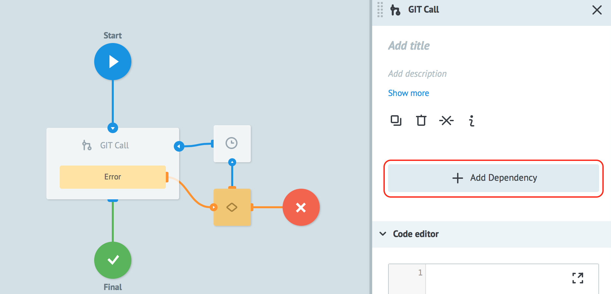
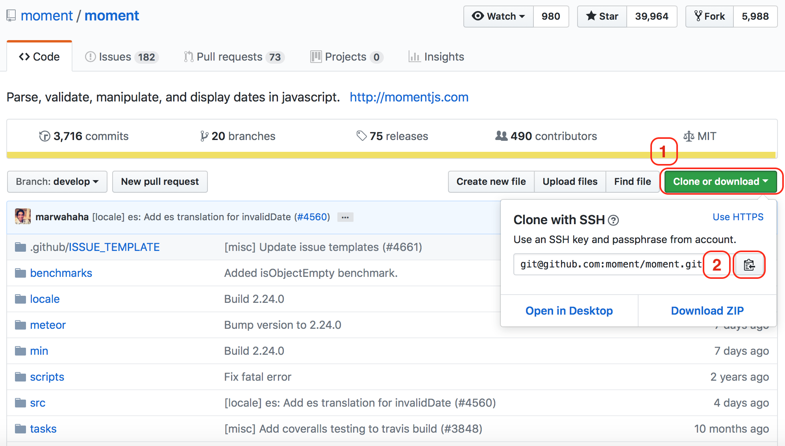
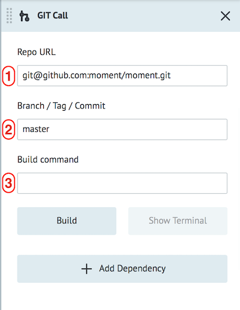
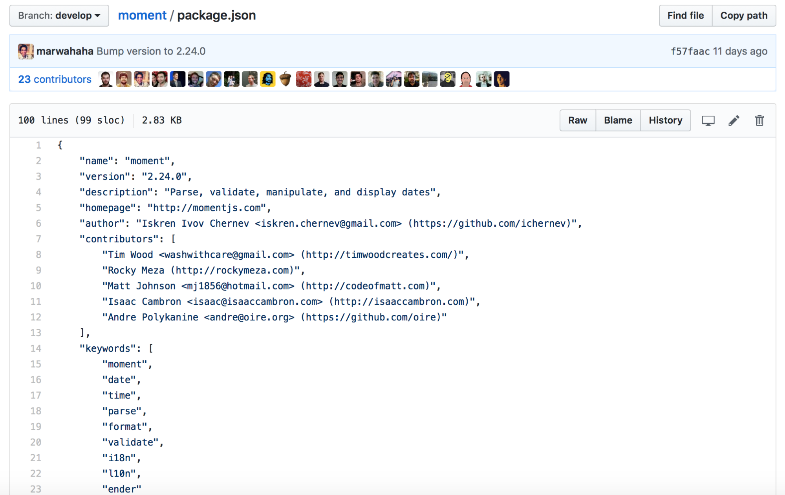
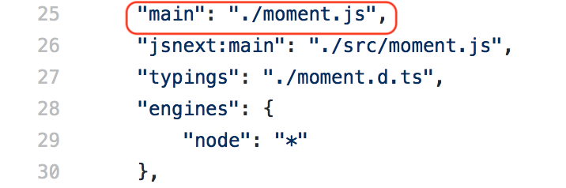
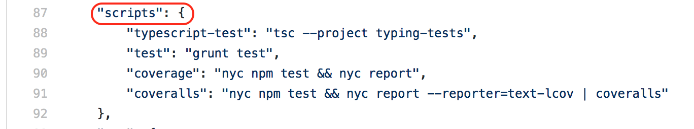
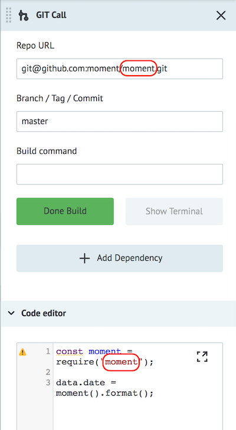
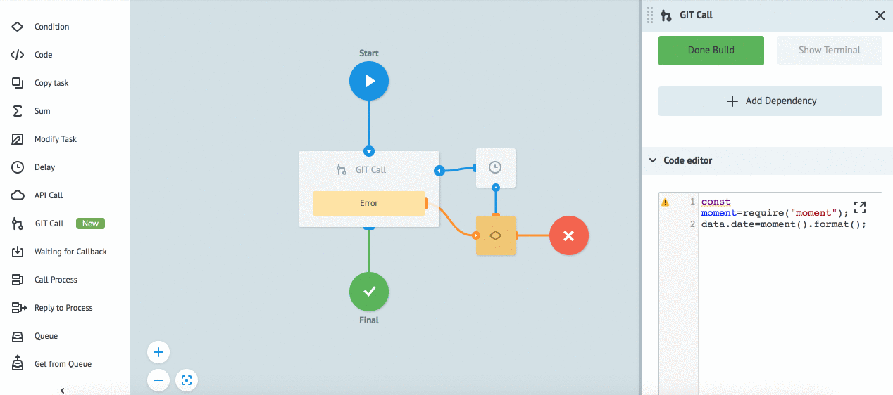

# GIT Call

**Use and manage program code from all over the world on any programming language with GIT Call node.**


**GIT Call** node provides opportunity to connect and execute code from Git repositories as a part of business process.


Supporting programming language: **JavaScript**.


**GIT Call node consists of 2 parts:**

1. [Connecting programming code from GIT](#connecting-programming-code-from-git)

2. [Executing connected code from GIT](#executing-connected-code-from-git)


### Connecting programming code from GIT

**Example of connecting the [MomentJS](https://github.com/moment/moment) library from GitHub for working with dates.**

Please follow the link to the library and read the file [README.md](https://github.com/moment/moment/blob/develop/README.md). It contains a description of the logic of the library and examples of using.


Let’s create process and add **GIT Call** node.



Push a button **"+ Add Dependency"**.


Copy link to [MomentJS Library](https://github.com/moment/moment), as shown below:

1. Push the button **Clone or download**
2. Copy link to the library



**Fill in the Dependency fields:**



1. paste the copied url into **Repo URL** field

2. specify **Branch / Tag / Commit**

By default - master. If you need to connect a specific version of code - you need to specify a tag (for example - v2.24.0). Please find out more info about branch [here](https://git-scm.com/book/en/v1/Git-Branching-What-a-Branch-Is).

3. **Build command** - command to build the library.

After adding a repository to the process, it has to be assembled. To do this, click button **Build**. Until the end of the library building process, the error *"Dependency not Build"* will be displayed in your process.

The console displays a message about the completion of the dependency setup.
Message about the about the correct dependency setup will be displayed in the console.


**Build command features**

In a file **package.json** we need to examine `dependencies` and `scripts`, which are used in this library. MomentJS has no specific build command, so leave this field empty. More info about the structure of **package.json** you can find [here](https://docs.npmjs.com/files/package.json).


In order to connect module, you need to use function `require("name of repository")`.

By default code invokes file [package.json](https://github.com/moment/moment/blob/develop/package.json), which is located in library root folder.



The starting point will be described in the **package.json** file with the key `main`. If it is empty, by default the code will call the **index.js** file.


In this example, the `main` object is described and no additional commands should be used to build it.



If there is no **index.js** file, then dependencies may need to be pre-built. To do this, examine the objects `dependencies`, `devDependencies`, `scripts`.

In the object `scripts`, only test scripts are described that do not affect the build.




Object `devDependencies` is described the list of dependencies which are used by this library.


In order to collect the dependencies that are necessary for the library to work correctly, enter the **yarn** command in the **Build command** field.

If the object `scripts` has a build command, then you need to add it to the **Build command** with “&&”.

*For example:* `yarn && yarn build`.


### Executing connected code from GIT

Execution of the connected code in the code editor based on [Node.js](https://nodejs.org/en/) (11.2.0).

Now let's try to use / run the connected library as a part of our process. To do this, enter the code to work with the library functions as shown below:

```
const moment = require("moment");
```
this variable describes initialization of MomentJS library to variable

```
data.datetime = moment().format();
```
call a function from the library


More information about working with MomentJS and data format could be found [here](http://momentjs.com).

Please note that when you call the `require()` function, you must specify the name of the repository you work with and it must match the name from the link to the repository:

git@github.com:moment/**moment**.git



Let’s deploy process and test how it works.

Go to **View** mode and create empty task in your process. You will get the current date and time in UTC.

Example:

```
{
"datetime": "2019-01-23T17:11:21+00:00"
}
```



You can directly work with the Node.JS methods, by calling methods and modules by declaring a variable using the construction `const { } = require(" ")`.

More information about the available Node.JS modules and methods in the [Node.js documentation](https://nodejs.org/api/assert.html).


> **Pay attention!** Work with sections C++, DNS, OS, Net, FS is terminated.