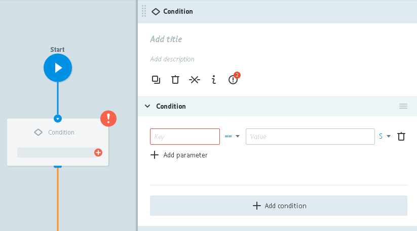
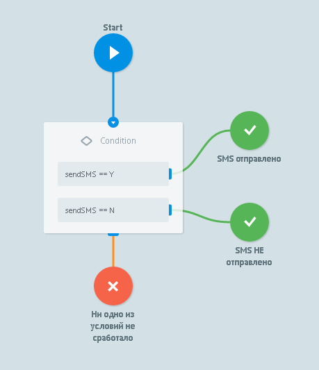

#Condition logic

Going by condition.




**`Key`**  should contain variable's name.

Possible format:
* parameter_name
* `{{obj.parameter_name}}` if there's a need to compose with attached parameter.
For example:
    *  `{{temp}}` - get "temp" variable value from the task
    *  `{{main.temp}}` - get "temp" variable value from "main" object
    *  `{{result.SUPPDOCUMENT\.CODE}}` - get "SUPPDOCUMENT.CODE" variable value from "result" object

**`Const`** may contain:
*   Value which need to be compared with 
*   {{value_name}} which need to be compared with

**`+ Add parameter`** - button for adding additional condition in current (through **"E"**)

**`+ Add condition`** - button for adding new condition

A few conditions in one node are executed as:
```
IF condition and condition and condition -> transfer
 OR
IF condition -> transfer
 OR
IF condition and condition -> transfer
```


> **Main reasons why the transfer On IF Logic is not working:**
>
> - Register or parameter name is specified incorrectly. Example: parameter in task says “Phone”, in IF Logic it is specified as "phone".
> - Field type in task is specified incorrectly. Example:in task “Count”:10(Int), in block Go If Count=10(String)
> - Attempt to compare two fields content. Example: condotion “amount”==”limt” will not execute, because the system will perceived it as a constant, rather than name


