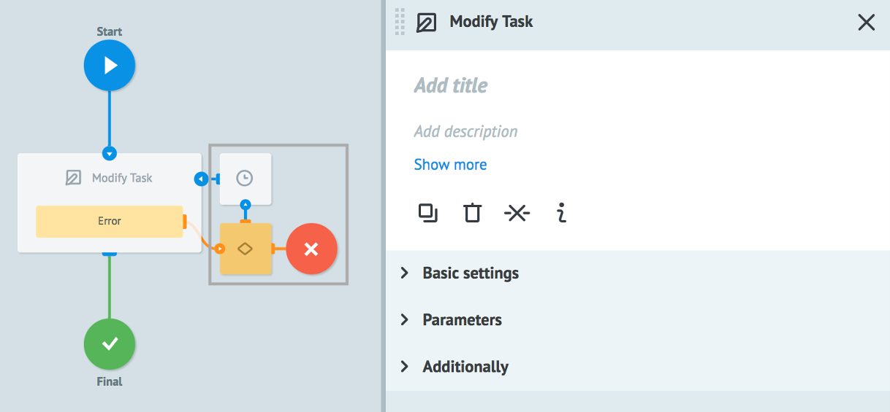
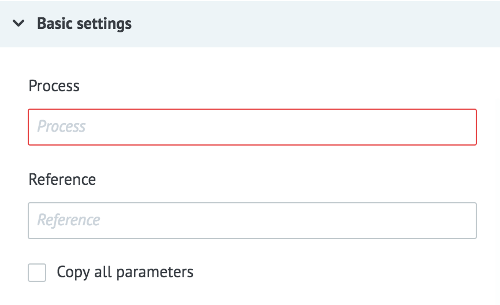
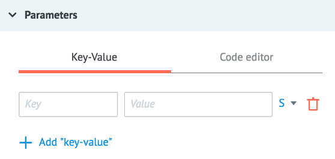
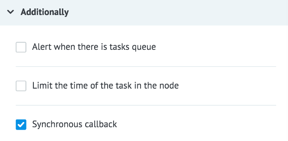

# Modify Task logic

Allows to modify (update) task in other available process.

There are two required requirements for modifying tasks via `Modify Task` logic:
* task must be in node with [Waiting for Callback](callback.md) or [Set State](setstate.md) logic
* specify correct task reference in `Modify Task` logic

Task reference can be specified with:
* any system parameter of the current process. For example, `{{root.ref}}` or `{{root.task_id}}`
* any other parameter of the current task `{{parameter_name}}`
* constant. For example, config, ref etc.

Nodes in the gray box are added automatically for error handling.

## Basic settings

**Process** - selection of a process for copying from "tree of folders". It can be found by its name or its ID or using the  `{{conv_id}}` (parameter of the task).

**Reference** - the reference of a new task that is created in another process.

New task reference can be specified by:
* any [system parameter](https://doc.corezoid.com/en/interface/tasks/task_archive.html#system-parameters). For example, `{{root.ref}}` or `{{root.task_id}}`
* any other task parameter `{{parameter_name}}`
* constant. For example, config, ref etc.

**Copy all parameters** - this option gives a possibility to copy all parameters to a new task.

> **Please note!**

> If both tasks have a parameter with the same name, parameter value will be updated by `Modify Task`.

> Параметры, которых не было в обновляемой заявке - добавятся в нее.

## Parameters

Button **+ Add "key-value"** adds new parameter

`Key` - parameter name
`Value` can be specified by:
- constant
- `{{parameter_name}}` from task which name will be pasted
- any system parameter of the current process. For example, `{{root.ref}}` or `{{root.task_id}}`

If **Copy all parameters** flag is enabled, it is not required to add new parameters.

Otherwise be sure to add at least one parameter.

## Additionally

#### Alert when there is tasks queue

Critical amount of tasks in the node.

Learn more about how it works [here](timer.md).

#### Limit the time of the task in the node

Time interval value at which task will go further through process in case if Copy task logic does not reply.

Learn more about how it works [here](timer.md).

#### Synchronous callback

**Synchronous callback** - this option gives a possibility to modify tasks synchronously.

It means that tasks will be updated sequentially - strictly one after another (in course).

> **Please note!** If you modify one task at the same time, an error [`duplicate_callback`](logika_modify_task.md#одновременное-изменение-заявки) will occur.

## Types of error

### Internal system error when copying

| Parameter name | Value |
| --- | --- |
| __conveyor_copy_task_return_type_error__ | hardware |
| __conveyor_copy_task_return_type_tag__ | copy_task_fatal_error |
| __conveyor_copy_task_return_description__ | Error running copy task |

| Parameter name | Value |
| --- | --- |
| __conveyor_copy_task_return_type_error__ | hardware |
| __conveyor_copy_task_return_type_tag__ | crash_api |
| __conveyor_copy_task_return_description__ | Error copy_task request |

| Parameter name | Value |
| --- | --- |
| __conveyor_copy_task_return_type_error__ | hardware |
| __conveyor_copy_task_return_type_tag__ | copy_task_timeout |
| __conveyor_copy_task_return_description__ | timeout for executing copy_task request |

### Not found task

| Parameter name | Value |
| --- | --- |
| __conveyor_copy_task_return_type_error__ | software |
| __conveyor_copy_task_return_type_tag__ | not_found_task |
| __conveyor_copy_task_return_description__ | not found task |

> There is no task with specified reference in the process.

### Incorrect parameters

| Parameter name | Value |
| --- | --- |
| __conveyor_copy_task_return_type_error__ | software |
| __conveyor_copy_task_return_type_tag__ | wrong_validate_params |
| __conveyor_copy_task_return_description__ | Param: <name>, Error: <error> |

> Failed to validate one of the parameters.

### Failed to convert parameter

| Parameter name | Value |
| --- | --- |
| __conveyor_copy_task_return_type_error__ | software |
| __conveyor_copy_task_return_type_tag__ | copy_task_wrong_convert_param |
| __conveyor_copy_task_return_description__ | Param: <name>, Value: <value>, Try convert to: <type> |

> For example, you parameter type is **Number**, but value is string or parameter is missed.

### Inactive process

| Parameter name | Value |
| --- | --- |
| __conveyor_copy_task_return_type_error__ | software |
| __conveyor_copy_task_return_type_tag__ | conveyor_is_not_active |
| __conveyor_copy_task_return_description__ | conveyor is not active |

> Process must be in the **Active** state.

### Access is denied

| Parameter name | Value |
| --- | --- |
| __conveyor_copy_task_return_type_error__ | software |
| __conveyor_copy_task_return_type_tag__ | access_denied |
| __conveyor_copy_task_return_description__ | user: <user_id>, conv_id: <proc_id> |

> User must have **Task management** [access](https://doc.corezoid.com/ru/interface/users_groups.html) to copy task.

### Task size overflow

| Parameter name | Value |
| --- | --- |
| __conveyor_copy_task_return_type_error__ | software |
| __conveyor_copy_task_return_type_tag__ | copy_task_size_overflow_limit |
| __conveyor_copy_task_return_description__ | Your task size: <size> bytes, Max available task size: <max_size> bytes, Try to change your data or try to split your task |

> Maximum allowed size - **128 Kb**.

### Duplicate modification of the task

| Parameter name | Value |
| --- | --- |
| __conveyor_copy_task_return_type_error__ | software |
| __conveyor_copy_task_return_type_tag__ | duplicate_callback |
| __conveyor_copy_task_return_description__ | The last one callback is still running. You should wait |

> Возникает только при включенном флаге **Synchronous callback**. Новое изменение заявки не отработает, пока не завершится предыдущее.

> Стандартно при возникновении такой ошибки заявка переходит в узел с логикой Delay для повторной попытки через 30 секунд.

### No callback logic in node with the task

| Parameter name | Value |
| --- | --- |
| __conveyor_copy_task_return_type_error__ | software |
| __conveyor_copy_task_return_type_tag__ | no_api_callback_in_node_with_task |
| __conveyor_copy_task_return_description__ | no api callback logic in node with task |

> This error occurs if **Synchronous callback** is enabled.

> Otherwise the result is `__conveyor_copy_task_result__": "ok".`