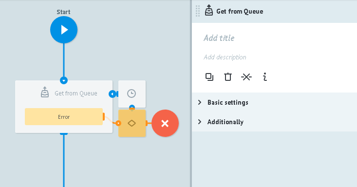
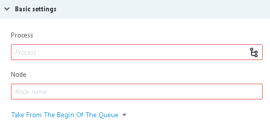
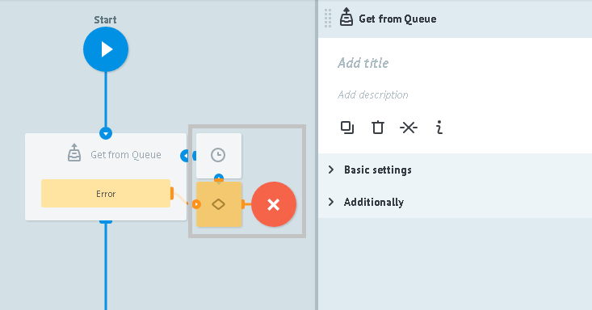

# Get from Queue logic

Getting tasks from process and node where [`Queue logic`](queue.md) is added.

**Get from Queue logic** adds in current task:
* `__queue_task_id__` -  task ID from node's Queue
* `__queue_task_data__` - json object of task parameters from node with [Queue logic](queue.md)

##Basic settings

**Process** - selection of process with [`Queue logic`](queue.md) from "catalog", by its name or its ID.

**Node** - selection of node with Queue from dropdown list of nodes of previously selected process.

**Take From The Begin Of The Queue** receive task from queue starting with the first (the oldest)

**Take From The End Of The Queue** - receive tasks from queue starting with the first (the most "fresh")

In **Process** and **Node**  it is possible to use dynamic values of task parameters. For example: {{conv_id}} - process ID, {{node_id}} - node ID.

##Additionally

####Alert when there is tasks queue

Critical amount of tasks in the node

Detailed [description](timer.md#tasks-limit) of logic work.

####Limit the time of the task in the node

Time interval value at which task will go further through process in case if `Get from Queue logic` does not reply.

####Debugging

When errors appears, process sends task ti the node with Condition logic

and adds some parameters to the task, appropriate to the error:

**There are no tasks in the node with API queue logic**

| Parameter name | value |
| -- | -- |
| `__conveyor_get_task_return_type_error__` | software |
| `__conveyor_get_task_return_type_tag__` | get_task_executing_error |
| `__conveyor_get_task_return_description__` | not_found_task |

**User does not have any access  to the process with API queue Logic**

| Parameter name | value |
| -- | -- |
| `__conveyor_get_task_return_type_error__` | software |
| `__conveyor_get_task_return_type_tag__` | get_task_executing_error |
| `__conveyor_get_task_return_description__` | access_denied |

**There are specified process or node without API queue logic**

| Parameter name  | value |
| -- | -- |
| `__conveyor_queue_return_type_error__` | software |
| `__conveyor_queue_return_type_tag__` | queue_wrong_logic |
| `__conveyor_queue_return_description__` | No queue logic in conv_id:  |

**Invalid transferred process id or id or node for dynamic use**

| Parameter name | value |
| -- | -- |
| `__conveyor_get_task_return_type_error__` | software|
| `__conveyor_get_task_return_type_tag__` | get_task_wrong_convert_param|

**Core error**

| Parameter name | value |
| -- | -- |
| `__conveyor_get_task_return_type_error__` | hardware |
| `__conveyor_get_task_return_type_tag__` | get_task_fatal_error |
| `__conveyor_get_task_return_description__` | Error running get task |
