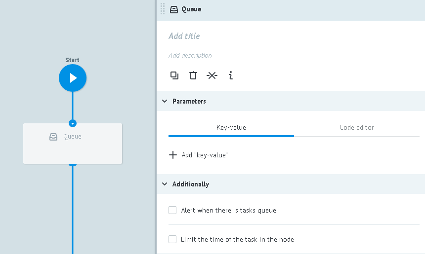

# Queue logic

Creates a queue from tasks in that node where it was added.

Tasks can be storaged in a queue  before two events happen:
* until moment of request for getting it from queue through [Get from Queue logic](get_task.md)
* until timer works if it was specified in next fields `Additionally -> Limit the time of the task in the node`

**Issuing from the queue:**

**1)** task transfers to next node and going further though process

**2)** calling task will be added with parameters:

* `__queue_task_id__` - task ID from node with Queue logic
* `__queue_task_data__` - json object of task parameters from node with Queue logic

##Parameters

**+ Add "key-value"** - adds to `__queue_task_data__` object new parameters, that are not available in task from node with `Queue logic`.

##Additionally

####Alert when there is tasks queue

Critical amount of tasks in node.

Detailed [description](timer.md#tasks-limit) of logic work.

####Limit the time of the task in the node

Time interval value at which task will go further through process in case if `Call Process logic` does not reply.

