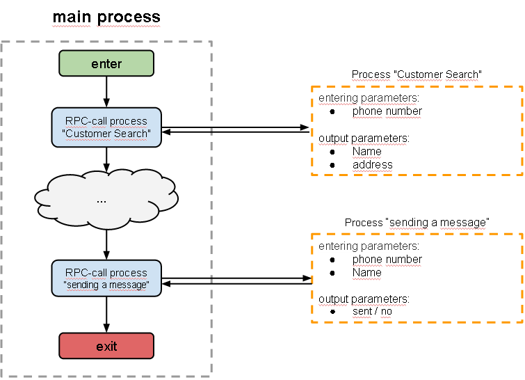

# Universal process call

Every repeatable processes (such as SMS sending, delivery time calculation and others) can be stood as separate (universal) processes.

To interact with universal processes you need to use:
*   [Call Process](logic_rpc.md) - universal process call
*   [Reply to Process](logic_rpc_reply.md) - reply on universal process call

Examples of processes with RPC:
*   [Main process](http://www.corezoid.com/admin/edit_conv/3432)
*   [Subordinate process](http://www.corezoid.com/admin/edit_conv/3433)
