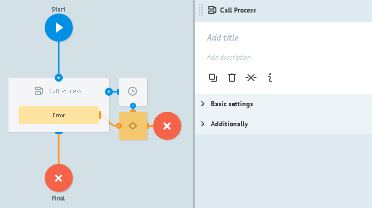
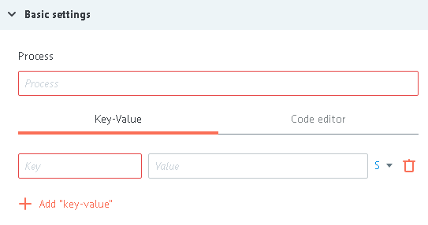
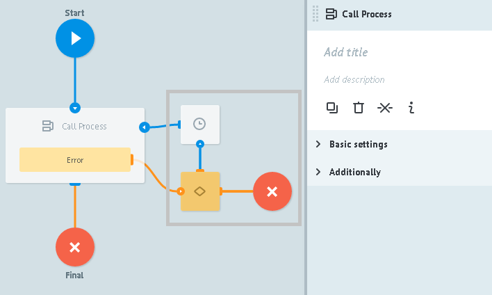

# Call Process logic

Universal process call.

>`Call Process logic` feature -

>task "freezes" in the node until reply will not be recieved from called (universal) process.

To avoid task "freeze", process should be customized by following one of the recomendations:

* return of called process reply should be customized in called process before every end node (successes, errors etc.) - [Reply to Process logic](logic_rpc_reply.md)
* specify maximum time of called process reply waiting (`Additionally -> Limit the time of the task in the node`), at which task will go further through process by prescribed for such cases logic.

##Basic settings

**Process** - selection of process from "process catalog" by its name or its ID.

**+ Add "key-value"** - button to add parameters required for successful call of universal process.

>If universal process have incoming to it described parameters then if you select such process in `Call Process logic`, this parameters will be added authomatically.

`Key` - name of the parameter that income to the universal process

`Value` value of incoming to universal process parameter. May contain:
- constant
- `{{parameter_name}}` from task which value will be pasted
- any system parameter of current process. For example, `{{root.ref}}` or `{{root.task_id}}`

##Additionally

####Alert when there is tasks queue

Critical amount od tasks in the node.

Detailed [description](timer.md#tasks-limit) of logic work.

####Limit the time of the task in the node

Time interval value at which task will go further through process in case if `Call Process logic` does not reply.

##Errors processing:

When an error occurs, the process sends a request to the Condition logic node 

и добавляет к заявке следующие параметры:

| Имя параметра | Значение | Описание |
| -- | -- | -- |
| `__conveyor_copy_task_result__` | crash_api | Ошибка отправки заявки в RPC процесс |
| `__conveyor_copy_task_result__` | access_denied | Нет доступа к указанному процессу |
| `__conveyor_rpc_return_type_tag__` | rpc_task_fatal_error | Ошибка отправки заявки в RPC процесс |
| `__conveyor_rpc_return_type_tag__` | rpc_task_size_overflow | Размер возвращаемых данных превышает 128kB |
| `__conveyor_rpc_return_type_tag__` | rpc_task_wrong_convert_param | Невозможно преобразовать переменные в указанные типы |
