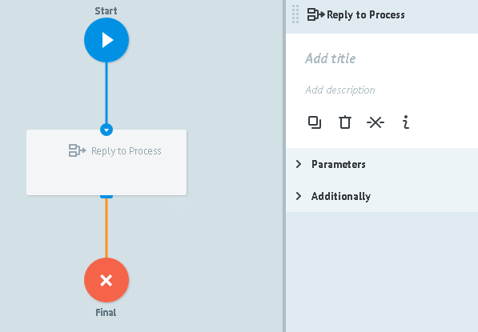
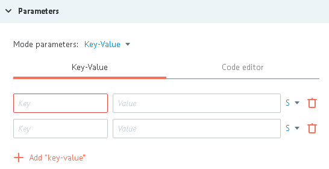
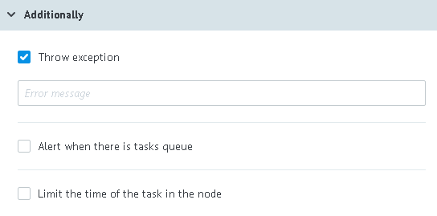

# Reply to Process logic

Reply on universal process call.

>In universal (called) process, Reply to Process logic should be added to every end node (successes, errors etc) to avoid task "freezing" in the calling process.

##Parameters

**+ Add "key-value"** - button to add parameters that will be transferred to reply on call.

##Additionally

####Throw exception

Availabiity of such flag returns reply to calling process in debugging node [Call Process logic](logic_rpc.md).

Error text, specified to `Error message` filed returns in `__conveyor_rpc_reply_return_description__` parameter

####Alert when there is tasks queue

Critical amount of tasks in the node.

Deatailed [description](timer.md#tasks-limit) of logic work.

####Limit the time of the task in the node

Time interval value at which task will go further though the process in case if  `Call Process logic` does not reply.
