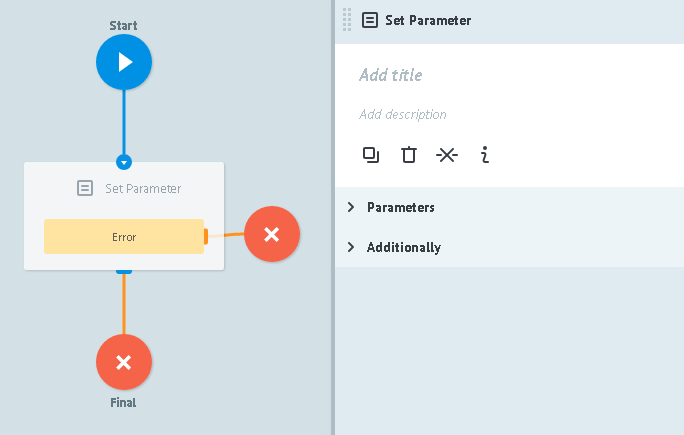
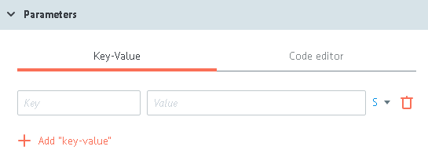

# Set Parameter logic

Allows to:
* add new parameters to the task and set its values
* change values os existing parameters in the task

In `Set Parameter logic` dropdown menu, execpt for system parameters,there are **only [described parameters](../process_and_state/parametrs.md)** available.

##Parameters

**+ Add "key-value"** - adding new parameter button

`Key` - new parameter name

`Value` may contain:
- constantк
- `{{parameter_name}}` from task, which value will be paste
- any system parameter of curren process. For example, `{{root.ref}}` or `{{root.task_id}}`
- any available [function](../functions/README.md):
  * [reading nodes parameters](../functions/getParamFromCount.md)
  * [getting task parameters value](../functions/getParamFromApp.md)
  * [time and date](../functions/unixtime.md)
  * [mathematical](../functions/math.md)

##Additionally

####Alert when there is tasks queue

Critical amount of tasks in the node.

Detailed [description](timer.md#tasks-limit) of logic work.

####Limit the time of the task in the node

Value of time interval, at which task will go further through the process in that case if `Set Parameter logic` does not answer.

Detailed [description](timer.md#timer) of logic work.
