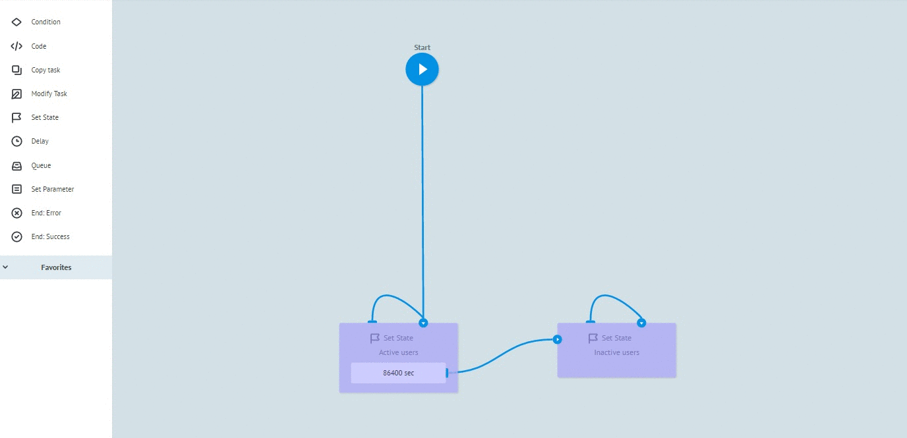

# Set State logic

Addition of logic is possible only in the process with **[State diagram](../process_and_state/state-diagram.md)** state

Allows to:
* Divide incoming stream of data to different the states
* Keep task states
* Accept state changes through task's "modify" using logic **[Modify task](logika_modify_task.md)**
* Get task parameters from tasks kept in **Set State** node of state diagram

Additional logic is available as part of **Set State**:
* [Condition](if.md) - allows to analyze task parameters after modify and transfer it to the required state
* [Alert when there is tasks queue](timer.md#tasks-limit) - allows to notify process while receiving critical amount of tasks in the node
* [Limit the time of the task in the node](timer.md#timer) - allows to transfer task to the next state in a specified time

