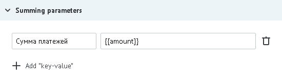

# Sum logic

Allows to sum the values on a particular task field.

## Summing parameters

* **Key** - here's specified the name of parameter, that will contain the sum of values.
* **Value** - `{{parameter_name}}` from task, which value is needed to sum or constant (constant value)

For example,

##Additionally

####Alert when there is tasks queue

Critiacal amount of tasks in the node

Detailed [description](timer.md#tasks-limit) of work logic.

####Limit the time of the task in the node

Time interval value at which the task will go further through the process in case if Sum logic does not answer.

Detailed [description](timer.md#timer) of work logic

>Sum logic value can be displayed on dashboard and dinamicly received through [construction](../functions/getParamFromCount.md) `{{node[node_ID].SumID}}`.

PrivatBank - largest participant of Individual Deposits Assurance Fund since its foundation. Individual Deposits Assurance Fund regularly trusts PrivatBank to pay compensation to depositors as the most reliable bank.