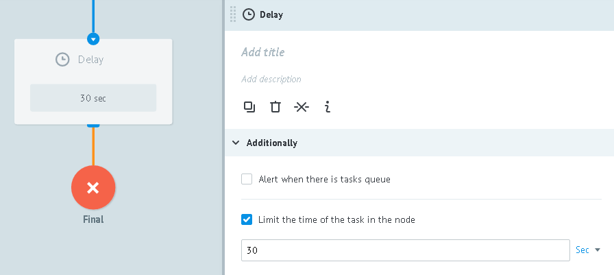

# Settings Additionally

## Limit the time of the task in the node

The time limit for the task stay in the node.

Time interval (delay) is specified in the field **Limit the time of the task in the node**.

After the time expires, the task goes to the specified node.

You can specify a value:
* number and select the units of measure: seconds (min 30), minutes, hours or days.
* task parameters (for example `{{unixtime}}`), which contains date/time in **unixtime** format
* function `$.unixtime()` (for example `$.unixtime(%y-%m-%d+1 09:00:00)`) to get the **Unix timestamp** of the exact time

By default, the node with the logic of **Waiting for Callback** created with a delay value of 1 day.
If there is no modify, the task goes to the final node after 1 day.

## Alert when there is tasks queue

Value in **Alert when there is tasks queue** is the critical number of tasks in the node or the tasks limit.

If the number of tasks in the node reaches the specified value, a signal (special new task) with the parameter `"start": "true"` is transmitted to the specified node.

When the number of tasks in the node decreases below a critical value, a signal is transmitted a node associated with the application parameter `" start ":" false "`.

