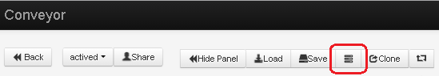
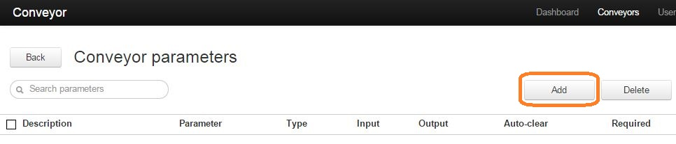
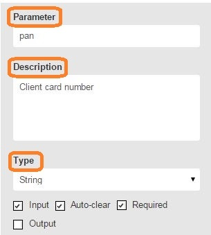
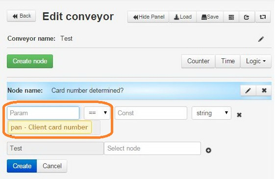

# Parameters of process

In order to describe parameters of process click on **`Edit process params`** in mode of editing process.

In this section you can specify name/parameter name of request, describe value, identify type (string, object, etc.), and incoming or outgoing parameter.

For adding a new parameter click on **`Add`** - the right field will become active.

Type the name of parameter in the field **`Parameter`**, for example «pan», then add description of parameter in the filed **`Description`** - «Credit card number of client», choose «string» in the field **`Type`**,  and place a check mark **`Input`**, **`Auto-clear`**, **`Required`**. Then, **`Ok`**.

«Input» means incoming parameter.

«Required» means compulsory.

«Auto-clear» - a check mark near the field «Auto-clear» (auto-deletion) hides the value of parameter if the request appears in the final node (red) and in the form of «*».

**What for to describe parameters?**

Parameters marked as **`Input` placed automatically into text request** and also while adding logics RPC and API_copy, and parameters indicated as **`Оutput`** - in RPC_reply.

Moreover, described parameters **can be chosen in all logics** from a drop-down list. The drop-down list is called with a double-click on the field for entering variable.

For example, in logic «Go_if»:

