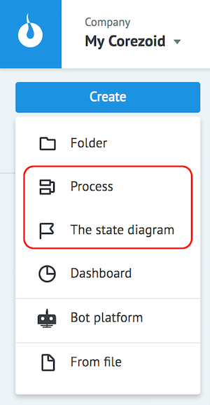

# Process and states diagrams

To implement the "States create processes, processes create states" concept there is 2 types of diagram created at Corezoid:

*   [**Process Diagram**](process-diagram.md)
*   [**State Diagram**](state-diagram.md)

Each of them has its own set of abilities and limits.

