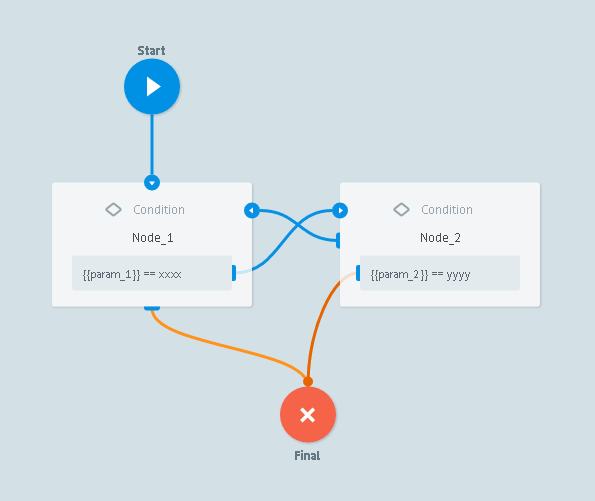
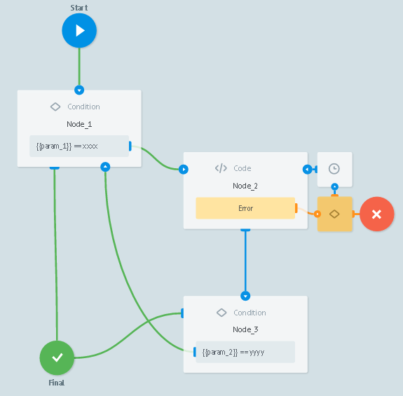

# Infinite Loops Protection rules

Processing will be stopped if task loops and will be cycled over 50 times in the process that contains one of two following logics:

```
Node_1 -> Node_2
Node_2 -> Nodes_1
```


```
Node_1 -> Node_2
Node_2 (CODE) -> Node_3
Node_3 -> Node_1
```

