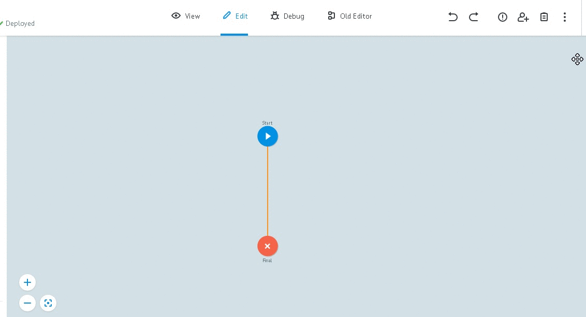
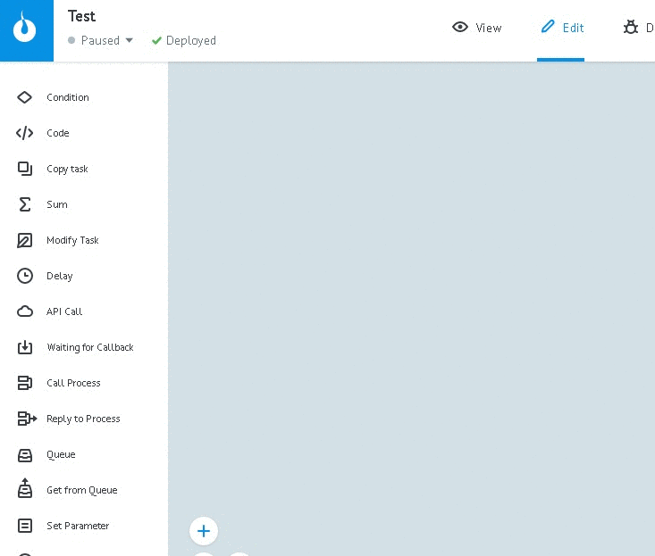

# Task parameters

In order to add task description:

* press "Task parameters" -> "+ Add parameter"
* in "Name" field add parameter's name
* in "Description" filed specify short description
* select type
* mark the parameter:
   * Input - income
   * Output - outcome
   * Required - required
   * Auto-clear - auto-removal. Hide parameter's value when task comes to end node and show it like "***"
* Press "Add"

**Why do I need to describe task's parameters?**

Parameters, marked as "Input", **automatically inserted in the manual task**, as well as by the addition of [Call Process logic](../nodes/rpc/logic_rpc.md) and [Copy Task logic](../nodes/copy.md).
Parameters, marked as "Оutput" - in [Reply to Process logic](../nodes/rpc/logic_rpc_reply.md).

Also, this parameters **can be chosen in any logics** from dropdown menu. Dropdown menu can be opened by double click on variable specifying field.

For example, in [Condition logic](../nodes/if.md):

described parameters are marked with gray background colour in task

